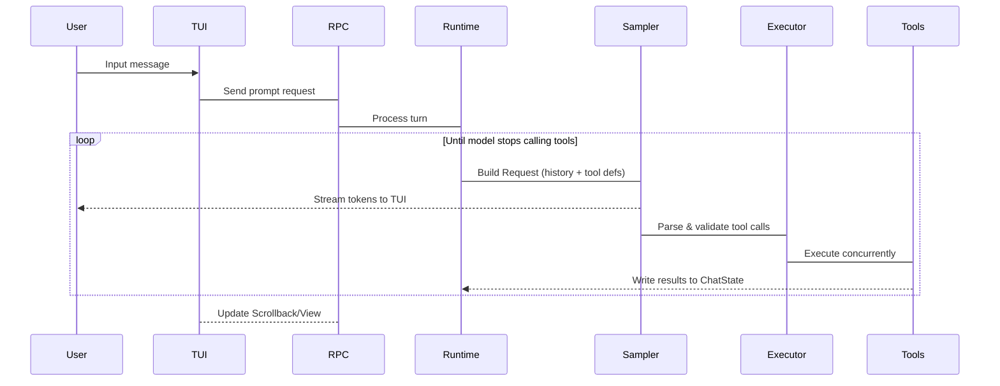

# Grok Build Architecture Summary Report

## 📋 Project Overview

**Grok Build** is SpaceXAI's terminal AI coding assistant. It runs as a full-screen TUI with capabilities for codebase understanding, file editing, command execution, web search, and long-running task management — supporting interactive mode, headless scripting/CI, and embedded ACP integration.

---

## 🏗 Technical Stack & Language

- **Primary Language**: Rust
- **Build System**: Cargo (workspace)
- **Dependency Management**: cargo crates.io + DotSlash runtime tool downloader

---

## 📦 Repository Structure Analysis

```
grok-build/
├── bin/                          # Runtime tools (e.g., protoc)
│   └── protoc                    # DotSlash-wrapped native protoc
│
├── crates/                       # Rust crate workspace (~70 crates total)
│   ├── build/                     # Build-time crates (proto codegen toolchain)
│   │   └──────── xai-proto-build    # Proto definitions → Rust code generator
│   │
│   ├── common/                    # Shared infrastructure libraries
│   │   ├──────── xai-circuit-breaker          # Circuit breaker pattern implementation
│   │   ├─── xai-computer-hub-*                # Computer Hub core SDK & MCP adapter
│   │   ├────xai-grok-compaction               # Conversation context intelligent compression
│   │   ├-----xai-interjection-core            # Interruption handling mechanism
│   │   └------tool-protocol/runtime/types       # Generic tool protocol stack (tool-* series)
│   │
│   └─── codegen/                  # CLI/TUI feature modules (~60 crates total)
│       ├──── xai-grok-pager-*            # TUI interface & rendering engine
│       │        ├── grok-pager-bin          # Entry binary (dependency assembly)
│       │        ├─ grok-pagger              # TUI core: scrollback/input/modal management
│       │        └──grok-pager-render        # UI component rendering & theme system
│       │
│       ├──── xai-groko-shell-*           # Agent runtime (session lifecycle)
│       │         ├── shell-base            # Shell base type definitions
│       │         ├─ session-support        # Session Actor support logic
│       │         └───shell                 # Agent runtime entry points (Leader/Follower/stdio)
│       │
│       ├──── xai-agents                  # Agent builder system (.grok agent files, prompts)
│       ├────xai-acp-lib                  # ACP protocol transport layer (JSON-RPC)
│       └───xai-chat-state                # Session state management (messages/tokens/persistence)
│       │
│       ├──────── xai-grok-tools           # Tool system core (~250 built-in tools)
│       │          ├──tools-api            # Tool API proto definitions (.proto files)
│       │         └───────tools             # Terminal ops/file editing/web search/MCP extensions
│       │
│       ├────────xai-grok-workspace-*      # Local workspace capability engine
│       │           ├──workspace-client     # Workspace API client layer
│       │          └───workspace-types      # Pure data type definitions (no deps)
│       │
│       └──────── ...                   # Other feature modules (~40 crates: config/auth/MCP/etc.)
│
├── prod/                         # Production-specific small crates
├── third_party/                  # Vendored upstream sources (Mermaid chart stack complete port)
└── docs/architecture.            # Detailed architecture documentation (already exists)
```

---

## 🎯 Core Architecture: Layered Actor Model

Grok Build uses a **five-layer vertical architecture** with clear responsibilities at each level:

### 1️⃤ Presentation Layer - UI & User Interaction

| Crate | Responsibility |
|-------|---------------|
| `xai-groker-pager-*` | TUI rendering (ratatui), keyboard/mouse input normalization, scrollback management, modal system |
| ACP Transport | JSON-RPC protocol implementation bridging frontend UI with backend runtime |

**Key Features**:
- Built on [`ratatui`](https://github.com/ratatul-org/rtatu) for terminal interface
- Three screen modes: Fullscreen (backup), Inline (embedded scrollback), Minimal (native)
- `TermWriter` async thread writes to stderr, avoiding event loop blocking

### 2️⃤ Runtime Layer - Agent Lifecycle Management

| Crate | Responsibility |-|
|-------|-|-1
| `xai-grok-shel-*` | SessionActor, tool call bridge, sampler manager, Leader/Follower IPC communication |
| `xai-ac-lb*` | Protocol adaptation layer: unified TUI/Headlessstdio interface abstraction |

**Core Loop**:
```
User message → Build Request(history + tool definitions) → Sampler stream response → ToolExecutor concurrent execution → ChatState update
```

### 3️⃤ Capabilities Layer - Feature Implementation

| Crate | Provides |-|
|-------|-1
| `xai-grok-too-*` | ~250 built-in capabilities: terminal commands, file ops (read/write/search), web fetch, image generation, etc. |
| `xai-workspac-*` | Filesystem abstraction(AsyncFileSystem), Git VCS integration, task execution backend, checkpoint system |

**ToolRegistry Architecture**:
1. **Static registration**: Built-in tools injected at compile time (`ToolRegistryBuilder::new()`)
2. **Dynamic extension**: MCP servers register at runtime via `FinalizedTooSet`
3. **Dispatch chain**: `use_tool → InnerDispatchForToolset → specific implementation`

### 4️⃤ State Layer - Session & Memory Management

| Crate | Capabilities |-|
|-------|-1
| `xai-chat-stat-*` | Actor-based conversation history, token usage stats, context pruning, disk persistence |
| `xai-memory-*` | Cross-session Markdown memory storage (~/.grok/) with SQLite + sqlite-vec vector search |

### 5️⃤ Infrastructure Layer - Cross-Cutting Concerns

| Crate | Functionality |-|
|-------|-1
| `xai-grok-confi*` | TOML config merging, Ed25519 policy validation, MDM preference integration |
| `xai-auth-*` | OAuth authentication (AuthCredentialProvider), HTTP retry middleware |
| `xai-http-*` | Process-shared reqwest client pool with unified User-Agent construction |
| `xai-grok-telme*` | Mixpanel event tracking, Sentry error reporting, OpenTelemetry metrics |
| `xai-secret*` | Sensitive data sanitization (tokens/URLs) |
| `xai-mcp-*` | MCP server sandbox isolation with rmcp + reqwest version compatibility handling |

---

## 🔄 Multi-Execution Mode Support Matrix

Grok Build supports multiple working scenarios through a unified runtime:

| Mode Name | CLI Command | Use Case |-|
|---------|-1
| **TUI **(Interactive) `cargo run -p grokr-pager-bin` (or GUI launcher) Desktop full-screen coding assistant |
| **Headless** `grok agent --headles` CI/CD pipelines, remote script execution |
| **Stdio** `grok stdi-agent` IDE plugin embedding (VS Code/Cursor) |
| **Leader/Follower** `grok leader `(main process) + client connections Single-machine multi-session service |

---

## 🧠 Agent Turn Loop Detailed Explanation



**Key Components**:

1. **SamplerActor**: Streaming responses, retry on 40 auth failure, request cancellation context compression when overflow occurs
2. **ToolExecutor**: Concurrent tool execution with serialized file writes for same path to prevent conflicts  
3. **CheckpointSystem**: Snapshot at each prompt boundary(file state + Git status), enables `rewind_to`rollback

---

## 🛠 Core Dependencies & Version Strategy

### Workspace Dependencies (~10 crates total)

**Primary Technology Stack Categories**:

```toml
# AI/ML Related
async-openai@v3 (fork from our-forks repo)
rhai@ v25 # Rust scripting engine for workflow orchestration  
petgraph    # Graph algorithms library (code dependency analysis)
tiny-skia   # Embedded graphics rendering

# Terminal UI
ratatui@ 0.29     # TUI framework core
crossterm         # Terminal abstraction layer
ansi-to-tui       # ANSI to TUI component conversion  
syntect           # Syntax highlighting with bundled themes

# Async Runtime
tokio@ v1(full)    # Async runtime foundation
async-openai        # LLM API client implementation
axum                # HTTP server framework

# Web & Network
reqwest@ 0.12      # HTTP client (rustls-tls, multipart support)  
tonic              # gRPC-web framework

# Filesystem & VCS Operations
gix@ v0.83         # Git operations library
ignore             # .gitignore rule processing
htmd               # HTML parsing with table extraction
```

**Build Optimization Configurations**:

| Profile | Purpose | Key Features |-|
|---------|-1
| `release`          | Default release build | Standard optimizations applied |
| `release-dist`     | Production distribution | Thin LTO + codegen=1 (maximum performance) |
| `x-prod`           | High-performance services | ThinLTO with panic="unwind" for better debugging |

---

## 🔬 Key Architecture Design Highlights

### 1. Fine-grained Crate Boundary Partitioning

Each feature module split into independent crate (`xai-grok-*naming convention), providing benefits:
- ✅ Easier single-crate testing (cargo test -p <crate>)
- ✅ Reduced compilation time through selective builds  
- ✅ Improved code reusability across modules
- ✅ Root workspace is auto-generated and read-only

### 2. Actor-Based State Management Pattern

Key actors run independently with distinct lifecycles:
- **SessionActor**: Session-level context management for message history
- **ChatStateActor**: Async task handling for persistence and pruning operations  
- **WorkspaceBackend**: TerminalExecutor capabilities maintain independent lifecycle

### 3. Unified Multi-Protocol Abstraction Layer

ACP (Agent Client Protocol) serves as the standardized JSON-RPC interface, abstracting away differences between execution modes:
```
TUI ↔ ACP ↔ Stdio ↔ Runtime
Headless    Leader/Follower
```

### 4. Secure Sandbox Architecture Design

- MCP servers run in isolated sandbox environments  
- `CapabilityMode` permission control with three strategies (Auto/Ask/YOLO)
- Filesystem abstraction supports multiple implementations: MockFs, AcpFAdapter, etc.

---

## 📊 Code Scale & Complexity Statistics

| Metric | Count Description |-|
|--------|-1
| Total Rust crates | ~70 in codegen + common workspace |
| xai-grok-pagger source files | 496 .rs files + 11 .snap test snapshots |  
| xai-gro-k-shell source files | ~737 total (including docs/examples/tests) |
| xai-ork-tools implementations | 250+ individual tool functions |
| Third-party sources vendored | Mermaid chart stack complete implementation (~35.rs files) |

---

## 🚀 Recommended Development Workflow

```bash
# ✅ Best practice: Single crate rapid iteration (avoid full workspace builds)
cargo check -p <target-crates>
cargo test -p <testing-crate>  
cargo clippy --all-target -p <linting-crates>

# ⚠ Caution: Full build takes considerable time, use sparingly
cargo run -p grok-page-bin           # Launch TUI interface
cargo build -p pager-binary--release  # Compile Release binary  

# 🧹 Enforce code style consistency  
cargo fmt --all
```

---

## 🔗 Related Technical Documentation Index

| Document Type | Location Description |-|
|--------------|-1
| Detailed Architecture Design | `docs/architecture.md (superset of this document) |
| User Operation Guides | `crates/grok-page/docs/user-guide/* (~15 topic articles)|  
| API Reference Docs | Generated via `cargo doc --al -p <crate>` command |
| Contributor Guidelines | `CONTRIBUTING.m` file in repo root |

---

## 📝 Current Git Status Note

**Note**: During this analysis, the following untracked build artifacts were detected and should be cleaned up:

- ❌ `package.json`: Node.js dependency configuration (should not exist - project is pure Rust)
- ❌ `bun.ck`: Bun package manager lockfile (irrelevant to Rust ecosystem)  
- ❌`node_module/`: npm cached dependencies directory (should be ignored via .gitignore)

**Recommended Action**: Check `.gitignore` configuration and ensure these build artifacts are properly excluded from version control.

---

*Report Generated: August 2, 2026*  
*Analysis Scope: Complete grok-build workspace codebase (crates/ directory)*
