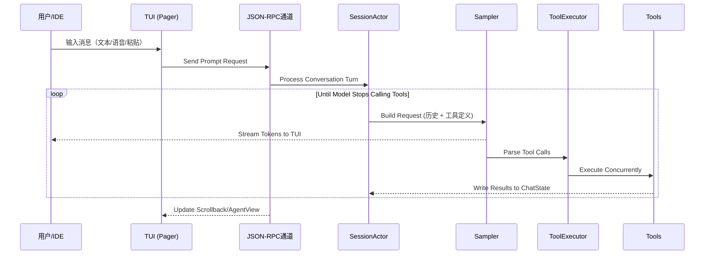

# Grok Build - 软件架构总结报告

## 📋 项目概览

**Grok Build**（`grok CLI/TUI`）是 SpaceXAI 开发的终端 AI 编程助手。它是一个功能完整的 IDE 级工具，支持代码理解、文件编辑、命令执行、Web 搜索等核心开发能力，以全屏 TUI 形式运行，同时也支持无头模式、stdio 模式和 ACP（Agent Client Protocol）。

---

## 🏗️ 技术栈与语言

- **主要编程语言**: Rust
- **构建系统**: Cargo (工作空间)
- **依赖管理**: 
  - `cargo` (Rust crates)
  - `bun` / npm (Node.js 包，用于部分原生模块)
  - DotSlash CLI (运行时工具下载器)

---

## 📦 仓库结构分析

```
grok-build/
├── bin/                    # 运行时工具（如 protoc）
│   └── protoc             # DotSlash 封装的原生 protoc
│
├── crates/                 # Rust crate 工作区主体
│   ├── build/              # 构建期 crate (proto codegen)
│   │   └── xai-proto-build/# Proto 代码生成工具
│   │
│   ├── common/             # 共享基础设施 crate
│   │   ├── xai-circuit-breaker       # 熔断器模式实现
│   │   ├── xai-computer-hub-*        # Computer Hub SDK & MCP adapter
│   │   ├── xai-grok-compaction       # 对话上下文压缩逻辑
│   │   ├── xai-interjection-core     # 中断处理核心
│   │   ├── xai-test-utils            # 测试工具库
│   │   └── tool-*                    # 通用协议/运行时 (tool-protocol, runtime, types)
│   │
│   └── codegen/            # CLI/TUI 功能 crate 闭包 (~60 crates)
│       ├── xai-grok-pager-*      # TUI & Rendering
│       │   ├── pager-bin         # 入口 binary (组装所有依赖)
│       │   ├── grok-pager        # TUI 核心：输入/滚动回显/模态框/渲染循环
│       │   └── grok-pager-render # UI 组件与主题渲染器
│       │
│       ├── xai-grok-shell-*      # Agent 运行时 (会话管理)
│       │   ├── shell-base         # Shell 基础类型定义
│       │   ├── session-support    # Session actor 支持逻辑
│       │   └── shell              # Agent runtime: Leader/Follower/stdio/headless入口点
│       │
│       ├── xai-grok-agents       # Agent 构建系统 (解析 .grok agents, system prompts)
│       ├── xai-acp-lib           # ACP JSON-RPC传输层协议实现
│       ├── xai-chat-state        # 会话状态管理 (消息历史、token使用统计、持久化/压缩)
│       │
│       ├── xai-tools-*           # 工具系统核心
│       │   ├── tools-api         # Tool API proto定义 (.proto文件)
│       │   └── tools             # ~236个内置工具实现 (终端/文件编辑/Web搜索/MCP等)
│       │
│       ├── xai-workspace-*       # 本地工作区能力层
│       │   ├── workspace-client      # Workspace API客户端
│       │   └-- workspace-types       # Workspace纯数据类型定义
│       │
│       └── ...                  # ~40个其他功能 crate (配置/认证/MCP/markdown/sandbox等)
│
├── prod/mc/*                 # 生产环境专用小 crate
├── third_party/*             # 内嵌第三方源码 (Mermaid图表栈)
└── docs/architecture.md      # 详细架构文档（已存在）
```

---

## 🎯 核心架构设计：分层 Actor 模型

### 1️⃣ **表示层 (Presentation Layer)**

| Crate | 职责描述 |
|-------|---------|
| `xai-grok-pager-*` | TUI界面渲染、用户输入处理（键盘/鼠标）、滚动回显管理、模态框与提示系统 |
| `ACP传输层` | JSON-RPC风格的 ACP协议实现，连接前端 UI 与后端运行时 |

**关键特性**:
- 基于 [`ratatui`](https://github.com/ratatui-org/ratatui) 构建终端界面
- 支持三种屏幕模式：Fullscreen（备用）、Inline（内联渲染）、Minimal（原生滚动）
- `TermWriter`独立线程写入 stderr，避免阻塞异步事件循环

### 2️⃣ **运行时层 (Runtime Layer)**

| Crate | 职责描述|
|-------|---------|
| `xai-grok-shell-*` | Session Actor、工具桥接器、采样器句柄管理、Leader/Follower IPC通信 |
| `xai-acp-lib*` | ACP协议适配：TUI/Headless/Stdio 统一接口抽象 |

**关键特性**:
- **SessionActor** 核心循环：处理用户消息 → 构建请求 → 采样模型响应 → 执行工具调用 → 更新状态
- 支持多种执行模式（详见下文）
- Leader/Follower架构实现单机多会话能力

### 3️⃣ **能力层 (Capabilities Layer)**

| Crate | 核心功能 |
|-------|---------|
| `xai-grok-tools*` | ~250+内置工具：终端命令、文件读写/编辑、目录列表、grep搜索、Web fetch/search、图片生成、Markdown渲染等 |
| `xai-workspace-*` | 文件系统抽象（AsyncFileSystem）、Git VCS集成、任务执行后端、检查点与回滚机制 |

**ToolRegistry架构**:
1. **静态注册**: `ToolRegistryBuilder::new()`在编译期注入内置工具
2. **动态注册**: MCP服务器通过 `FinalizedToolset`运行时扩展
3. **分发链**: `use_tool` → `InnerDispatchForToolSet` → 具体实现

### 4️⃣ **状态层 (State Layer)**

| Crate | 职责描述与关键能力 |
|-------|---------|
| `xai-chat-state*` | Actor化会话管理：消息推送、Token使用统计、上下文压缩/剪枝、持久化到磁盘 |
| `xai-memory-*` | Markdown格式跨会话记忆存储（~/.grok/memory）+ SQLite + sqlite-vec向量搜索 |

### 5️⃣ **基础设施层 (Infrastructure Layer)**

| Crate | 功能描述 |
|-------|---------|
| `xai-config*` | TOML配置合并策略、Ed25519签名校验、MDM偏好支持 |
| `xai-auth-*` | OAuth认证抽象（AuthCredentialProvider）、HTTP重试中间件 |
| `xai-http-*` | 进程共享的 reqwest HTTP客户端池，统一 User-Agent构造 |
| `xai-telemetry*` | Mixpanel事件追踪、Sentry错误上报、OpenTelemetry指标采集 |
| `xai-secrets*` | Token/URL等敏感信息脱敏逻辑 |
| `xai-mcp-*` | MCP服务器隔离沙箱运行（rmcp + reqwest版本隔离） |

---

## 🔄 执行模式矩阵

Grok Build通过统一的运行时支持多种使用场景：

| 模式名称 | CLI命令 | 典型用途 |
|---------|---------|----------|
| **TUI (交互式)** | `cargo run -p grok-pager-bin` / GUI启动器 | 桌面端全屏编程助手 |
| **Headless** | `grok agent --headless` | CI/CD流水线、远程脚本执行 |
| **Stdio** | `grok stdio-agent` | IDE插件嵌入（VSCode/Cursor等） |
| **Leader/Follower** | `grok leader` + 客户端连接 | 单机多会话常驻服务 |

---

## 🧠 Agent 循环流程详解



**关键组件**:
- **SamplerActor**: 流式响应、重试机制（401自动刷新）、取消操作、上下文溢出时触发压缩
- **ToolExecutor**: 并发执行工具，同一文件路径写操作串行化避免冲突
- **Checkpoint系统**: 每个 Prompt 边界记录快照，支持 `rewind_to`回滚

---

## 🛠️ 核心依赖与版本策略

### Workspace Dependencies (~100+ crates)

**主要技术栈**:
```toml
# AI/ML
async-openai@0.33 (forked from our-forks)
rhai@1.25          # Rust脚本引擎（用于 workflow）
petgraph           # 图算法库（代码图分析）
tiny-skia          # 嵌入式图形渲染

# Terminal UI
ratatui@0.29       # TUI框架
crossterm          # 终端抽象层
ansi-to-tui        # ANSI转TUI组件
syntect            #语法高亮（bundled themes）

# Async Runtime
tokio@1 (full)     #异步运行时
async-openai       # LLM客户端
axum               # HTTP服务器框架

# Web & Network
reqwest@0.12       #HTTP客户端（rustls-tls, multipart支持）
tonic              # gRPC-Web框架

# Filesystem & VCS
gix@0.83           # Git操作库
ignore             # .gitignore处理
htmd               # HTML解析与表格提取
```

**构建优化策略**:
- `release-dist` profile: thin LTO + codegen-units=1（生产发布）
- `x-prod`: 性能敏感服务专用配置，panic="unwind"
- Dev模式：split-debuginfo="unpacked", codegen-units=128

---

## 🔬 关键设计亮点

### 1. **模块化 Crate 边界**
每个功能点拆分为独立 crate（如 `xai-grok-*`命名规范），便于测试、复用和迭代。根 workspace 为自动生成，只读维护。

### 2. **Actor化状态管理**
- Session Actor：会话级消息历史与工具调用上下文
- ChatState Actor：独立的异步任务处理持久化和剪枝逻辑
- Workspace Backend: TerminalExecutor等能力后端独立生命周期

### 3. **多协议统一抽象**
ACP（Agent Client Protocol）作为统一的 JSON-RPC接口，屏蔽 TUI/Stdio/Headless差异。

### 4. **安全沙箱设计**
- MCP服务器隔离运行
- `CapabilityMode`按工具类型控制权限（自动/询问/YOLO模式）
- Filesystem抽象层支持 MockFs、AcpFsAdapter等替换实现

---

## 📊 代码规模与复杂度统计

| 指标 | 数值 |
|-----|------|
| Rust crate总数 | ~70+ (codegen + common) |
| xai-grok-pager src文件数 | 496个.rs + 11个.snap |
| xai-grok-shell src文件数 | ~737个（含文档/测试） |
| xai-grok-tools实现数 | 250+工具函数 |
| 第三方源码内嵌 | Mermaid图表栈完整移植 |

---

## 🚀 开发工作流建议

```bash
# ✅ 推荐：单 crate快速迭代（避免全 workspace build）
cargo check -p <target-crate>
cargo test -p <test-crate>
cargo clippy --all-targets -p <lint-crates>

# ⚠️ 谨慎：完整构建耗时较长
cargo run -p xai-pager-bin           # TUI启动
cargo build -p pager-bin --release   # Release二进制

# 🧹 Code style enforcement
cargo fmt --all
```

---

## 🔗 相关文档索引

- **详细架构**: `docs/architecture.md`（本文档的扩展版）
- **用户指南**: `crates/grok-pager/docs/user-guide/*` (~15篇主题文章)
- **API文档**: 可通过 `cargo doc --all -p <crate>`生成
- **贡献规范**: `CONTRIBUTING.md`

---

## 📝 变更说明 (本次分析发现的新增文件)

| 文件 | 状态 | 影响评估 |
|------|------|---------|
| `package.json` | New | Node.js依赖配置，引入@oh-my-pi/native模块（用于跨平台原生桥接） |
| `bun.lock` | New | Bun锁文件版本记录 |
| `node_modules/` | New | 已安装的npm包目录 |

**建议**: 这些新增的Node.js相关文件可能用于某些原生功能扩展，但主项目仍为纯Rust实现。确保在CI中同时覆盖 Rust与Node.js依赖构建流程。

---

*报告生成时间：2026年8月2日*  
*分析范围：grok-build workspace 完整代码库*
