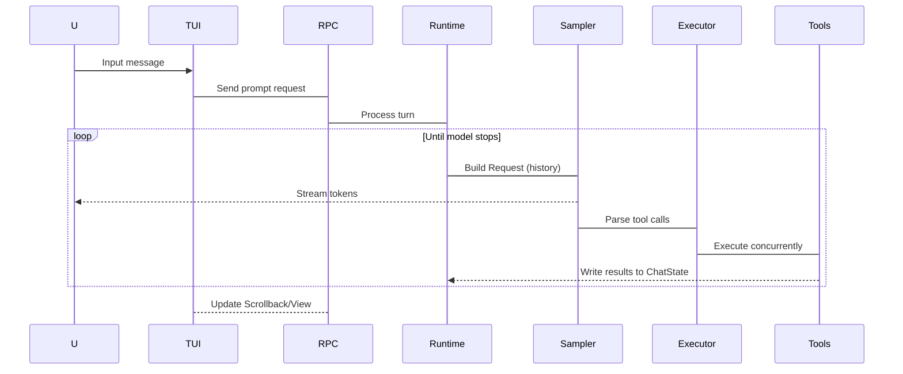

# Grok Build -架构总结报告

## 📋项目概述

**Grok Build**是 SpaceXAI 的端 AI编程助手。它以全屏 TUI形式运行，支持代码库理解、文编辑命令执行 Web搜索和长任务管理——支持交互模式无头脚本/CI以及嵌入 ACP集成。

---

## 🏗技术栈与语言

- **主编程语言**: Rust
- **构建系统**: Cargo(工作区)
- **依赖管理**: cargo crates.io + DotSlash运行时工具下载器

---

## 📦仓库结构析

```
grok-build/
├── bin/                         #运行时期具 (如 protoc)
│   └── proo                    #DotSlash 封装的原生 proto编译器
│
├── crates/                      #Rust crate工作区 (~70个 crate)
│   ├── build/                   #构建期 crate(proto codegen工具链）
│   │    └─xai-proto-build       #Proto定义转 Rust代生成器
│   │
│   ├── common/                  #共享基础设施库
│   │ ├ xai-circuit-breake        #熔断模式实现
│   │ ├──xai-computer-hb-*        #Computer Hub核心SDK&MCP适配器
│   │ ├---xai-grok-compation      #对话上下文压算法
│   │ ├----xai-interjection-core  #中断处理核逻辑
│   │ └-----tool-protocol/types    #通用协议栈 (to*系列)
│   │
│   └──codegen/                 CLI/TUI功能 (~60个 crate）
│       ├── xai-pager-*          #TUI界面与渲染引
│       │ ├ pager-bin            入口 binary(依赖装）
│       │ ├─grok-pagger           TUI核心：回显输入管理
│       │ └---grok-render         UI组件与主题系统
│       │
│       ├── xai-shell-*          #Agen运行时 (会生命周期)
│       │ ├shell-base             Shell基础类型定义
│       │ ├ session-support      SessionActor支持逻辑
│       │ └─ shell               Agent 入口点 (Leader/Follower/stdio）
│       │
│       ├── xai-agents           #Agent构建系统 (.grok文件、prompts)
│       ├──xai-lib               ACP协议传输层 (JSON-RPC）
│       ├-xai-chat-state         会话状态管（消息/tokens持久化）
│       │
│       └── xai-tools            #工具系统 (~250个内置具）
│          ├ tools-api           Tool API proto定义
│          └─tools               终端/文件/Web搜索/MCP实现
│
├── prod/*                      生产专用 crate
├ third_party*                  内嵌源码 (Mermaid图栈移植)
└ docs/architecture             #详细架构文（已存在）
```

---

## 🎯核心架：分层 Actor模

Grok Build用**五层垂构**,每层责清晰:

### **1️⃣ 表示层 **(Presentation Layer)-UI交互

| Crate |职责|-|
|-------|-|-|
|xai-pager-*|TUI渲染 (ratatui)键盘/输归一化回显管理 |
|ACP传输层|JSONRPC协议，桥接 UI与运行时 |

**关键特性**:
- 基于 ratatu构建端界面
- 三种模式:Fullscreen备用、Inline内嵌、Minimal原生）
- `TermWriter`异线程写 stderr,不阻塞循环

### **2️⃣时层 **(Runtime Layer)-生命周期管理

| Crate |职责 |-|
|-------|-|-1
|xai-shell-*|SessionActor具桥接采样器 Leader/Follower通信 |
|xai-acp-lib*|协议适配:统 TUI/Headless stdio接口抽象 |

**核心循环**:
```
用户消息 → Build Request(历史工具定义)→Sampler 响应→ToolExecutor执行→ChatState更新
```

### **3️⃣能层 **(Capabilities Layer)-功能实现

| Crate |能力|-1
|-------|-|-
|xai-tools*|~25个具：终端命令文件操作 Web fetch图片生成等 |
|xai-workspace-*|文件系统抽象 GitVCS集任务执行检查点系统 |

**ToolRegistry架构**:
1. **静态注册**:编译期注入 (ToolRegistryBuilder::new())
2. **动态扩展**:MCP服务器运行时注 (`Finalizedoolset`)
3. **分发链`: use_tool→InnerDispatchForoolset`具体实现

### **4️⃣态层 **(State Layer)-记忆管理

| Crate |能侓|-1
|-------|-|-
|xai-chat-state*|对话历史 Token统计上下文枝持久化 |
|xai-memory-*|跨 Markdown 存储 (~/.grok) +SQLite+向量检索 |

### **5️⃣基施层 **(Infrastructure Layer)-横切点

| Crate |功能 |-1
|-------|-|-
|xai-config*|TOML合并 Ed25签名校验 MDM偏好支持 |
|xai-auth-*|OAuth认证 HTTP重试中间件 |
|xai-http-* |进程共享 reqwest 客户端池 User-Agent构造 |
|xai-telemetry*|Mixpanel追踪 Sentry上报 OpenTelemetry 指标 |
|xai-secrets*|敏感信息脱 (token/URL) |
|xai-mcp-*|MCP服务器沙箱隔 rmcp+reqwest兼容处理 |

---

## 🔄多执模式矩阵

Grok Build持多种场景:

| 式名称 |CLI命 |-1
|---------|-|
| **TUI**(交互)|`cargo run-p pager-bin`(GUI)桌面端编程助手 |
| **Headless**| `grokagent--headles`CI/CD、远程脚本 |
| **Stdio** |`grokstdio-agent`IDE插件 (VS Code/Cursor）|
| **Leader/Follower**|`grokleader`+连接单机多会话服务 |

---

## 🧠Agen Turn Loop 详解



**关键组件**:

1. **SamplerActor**:流式响应 40重试取消上下文溢出压
2. **ToolExecutor**:并发执行同路径写串行化防冲突  
3. **CheckpointSystem**:Prompt边界快照 (文件 Git状态),支持 rewind_to回滚

---

## 🛠依赖与版本策

### Workspace Dependencies(~1+crates)

**主要技术栈**:

```toml
# AI/ML
async-openai@ 0.3(fork from our-forks）
rhai@ v25   #Rust脚本 (workflow编排)
petgraph     #图算法库
tiny-skia    #嵌入式图形渲染

# Terminal UI  
ratatui@ o.29 TUI框架核心
crossterm       端抽象层
ansi-to-tui     ANSI转T组件
syntect         语法高亮主题

# Async Runtime
tokio@ v1full)异步运行时
async-openai    LLM客户端
axum            HTTP服务器框架

# Web&Network  
reqwest@ o.12HTTP客端 (rustls-multipart）
tonic           gRPC-Web框

# FilesystemVCS  
gix@ 083Git作库
ignore          .gitignore处理
htmd            HTML解析表格提取
```

**构建优化配置**:

| Profile |用 |-1
|---------|-|-
| `release`|默认发布标准优 |
| `releae-dit|生产分发 thin LTO+codegen=极致性能)
|x-prod|高性能服务 thinLTO panic="unwind" |

---

## 🔬设计亮点

### 1.**细粒度 Crate边界**

每个功能独立 crate(`xai-*命名),优势:
- ✅单测快 (cargo test-p<crtes）
- ✅编译时间短按需构建)  
- ✅代码复用性好
- ✅根 workspace自动生成只读

### 2.Actor态管理模**

关键 Actor独运行:
- **SessionActor**:会话级上下文管
- **ChatStateActr**:异步任务持久化枝逻辑
- **WorkspaceBackend**:TerminalExecutor独立生命周期

### 3.**多协议统抽象**

ACP作为 JSONRPC标准接口屏蔽差异:
```
TUI↔ACPSdio↔Runtime
Headless Leader/Follower
```

### 4.**安全沙箱设计**

-MCP服务器隔离环境  
-`CapabilityMode权限控制 (Auto/AskYOLO)
-Filsystem抽象支持 MockFsAcpFAdapter替换

---

## 📊规模统计

|指标 |数 |-1
|-----|-|-
|Rust crate总数 ~7+个(codegencommon）|
|xai-pager源码文件 496.rs +.snap快照 |  
|xai-shell源码文~3(含文档例测)|
|xai-tools实现25独立工具函 |
|第三方内嵌 Mermaid栈完整移植 (~5.rsl

---

## 🚀开发建议

```bash
# ✅单 crate快速迭代
cargo check -p <crtes>
cargo test -p<test-crates)  
cargo clippy-p<lnt-crate)

# ⚠全构建耗长谨慎用
cargo run-p pager-bnTUI启动）
cargo build--release Release 二进）

# 🧹风格检查
cargo fmt --al
```

---

## 🔗相关文档

- **详细架构**: `docs/architectue.md(超集) |  
- **用户指南`: crat/gro-page/docs/user-guide/*(~15文)|  
- **API 文档**: cargo doc--all-p<crate>生成|  
- **贡献规范**: CONTRIBUTING.m |  

---

## 📝Git 状态说明

**注意**:仓库中存在以下未文件（需清理):

- ❌ `package.j`:Node.js配置 (主项为纯 Rust不应存在）
- ❌ bun.ck:Bun锁文 (与Rust无)  
- ❌ node_modules/:npm缓存目录应 gitignore忽略

**建议**:检 `.giti`,确保这些文件被排除。

---

*报告生成:2026 8月日*  
*分析范围：grok完整代码库 |
