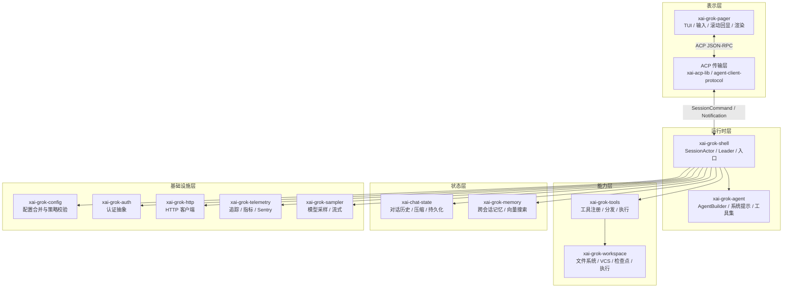
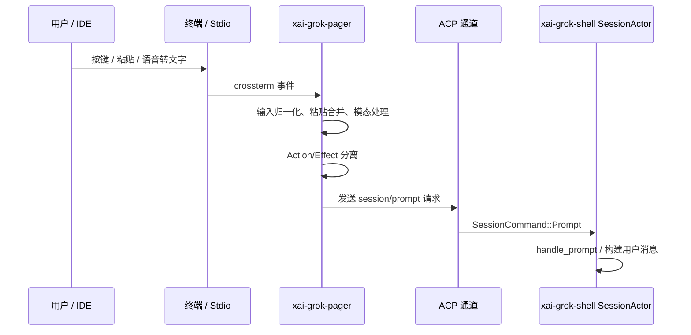
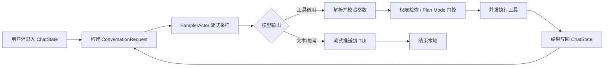
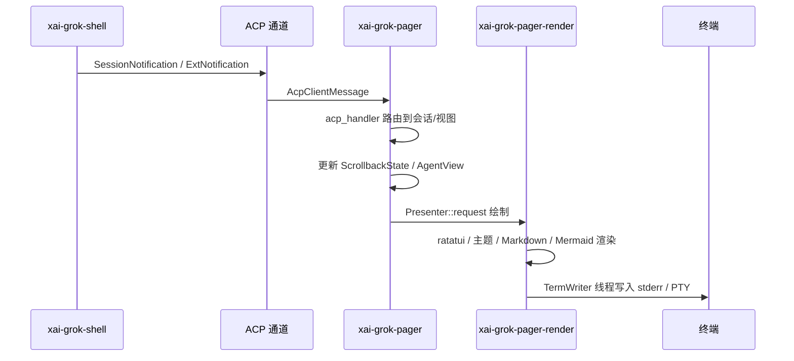
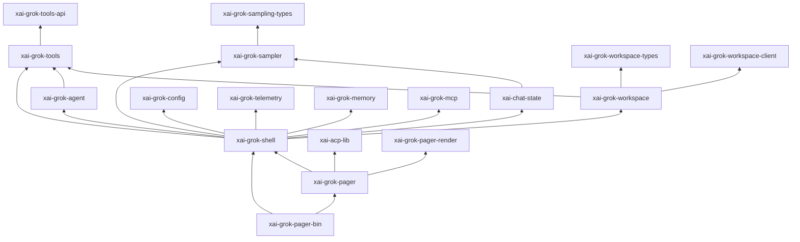

# Grok Build 软件架构与流程文档

> 本文件基于仓库 `crates/` 下源码结构、根 `Cargo.toml` 以及 `README.md` 整理，描述 Grok Build（`grok` CLI/TUI）的整体架构、核心数据流与 crate 职责。

---

## 1. 项目概述

**Grok Build** 是 SpaceXAI 的终端 AI 编程助手，以全屏 TUI（Terminal User Interface）形式运行，同时支持无头（headless）、stdio、Leader/Follower 以及 ACP（Agent Client Protocol）嵌入式等多种执行模式。

核心能力：

- 代码库理解与多语言代码图索引
- 文件编辑、Shell 命令执行、Web 搜索
- 长会话管理、持久化、压缩与回滚
- MCP（Model Context Protocol）服务器与插件扩展
- 多模态输入（语音、图片）、Markdown/Mermaid 渲染

---

## 2. 仓库布局

```text
grok-build/
├── Cargo.toml                 # 自动生成的工作区根，只读
├── rust-toolchain.toml        # 固定 Rust 工具链
├── clippy.toml / rustfmt.toml # 代码风格与 lint
├── bin/protoc                 # DotSlash 封装的 protoc
├── crates/
│   ├── build/                 # 构建期工具（proto codegen）
│   ├── codegen/               # 主体 CLI/TUI crate 闭包
│   └── common/                # 共享叶子 crate（工具协议、熔断、tracing 等）
├── prod/mc/                   # 生产环境相关小 crate
└── third_party/               # 内嵌上游源码（Mermaid 图表栈等）
```

### 2.1 关键目录说明

| 路径 | 说明 |
|------|------|
| `crates/codegen/xai-grok-pager-bin` | 可执行 crate，组装并启动整个应用 |
| `crates/codegen/xai-grok-pager` | TUI 主库：滚动回显、输入、模态框、渲染 |
| `crates/codegen/xai-grok-shell` | Agent 运行时：会话 actor、Leader/stdio/headless 入口 |
| `crates/codegen/xai-grok-agent` | Agent 定义与构建：解析 `.grok/agents/*.md`、系统提示、工具集 |
| `crates/codegen/xai-grok-tools` | 内置工具实现与工具注册/分发运行时 |
| `crates/codegen/xai-grok-workspace` | 本地工作区引擎：文件系统、VCS、执行、检查点 |
| `crates/codegen/xai-chat-state` | 会话状态 actor：消息历史、token 使用、压缩、持久化 |
| `crates/codegen/xai-grok-sampler` | 推理采样层：流式 HTTP、重试、取消 |
| `crates/codegen/xai-grok-models` | 默认模型 ID 配置 |
| `crates/common/xai-tool-*` | 通用工具协议、运行时、类型定义 |

---

## 3. 高层架构

Grok Build 采用**分层 actor 架构**：

- **表示层（Presentation）**：`xai-grok-pager` 负责 TUI；headless/stdio 模式绕过 TUI，直接通过 ACP 与运行时通信。
- **运行时层（Runtime）**：`xai-grok-shell` 持有会话 actor、工具桥、采样器句柄、Leader/ACP 适配器。
- **能力层（Capabilities）**：`xai-grok-tools` + `xai-grok-workspace` 提供文件、终端、搜索、Web、MCP、检查点等具体能力。
- **状态层（State）**：`xai-chat-state` 管理对话历史；`xai-grok-memory` 管理跨会话记忆。
- **基础设施层（Infrastructure）**：配置、认证、HTTP、遥测、崩溃处理、tracing。



---

## 4. 执行模式

Grok Build 支持多种运行形态，全部收敛到同一套 `xai-grok-shell` 运行时：

| 模式 | 入口 | 说明 |
|------|------|------|
| **交互式 TUI** | `cargo run -p xai-grok-pager-bin` | 全屏终端界面，默认模式 |
| **Headless** | `grok agent headless` | 无 UI，仅通过 relay WebSocket 与后端交互 |
| **Stdio** | `grok agent stdio` | 标准输入输出上的 ACP，适合 IDE/脚本 |
| **Leader** | `grok agent leader` | 单机单 Leader 常驻进程，Follower 通过 Unix socket 连接 |
| **Serve** | `grok agent serve` | 提供 WebSocket 服务端点 |
| **ACP 嵌入** | `xai-acp-lib` | 编辑器/插件通过 ACP 协议嵌入 Agent |

`xai-grok-pager-bin/src/main.rs` 负责解析 CLI 参数并路由到对应入口；TUI 路径调用 `xai_grok_pager::app::run`，非 TUI 路径调用 `xai_grok_shell::agent::app::{run_headless, run_stdio_agent, run_leader, …}`。

---

## 5. 核心数据流

### 5.1 用户输入 → Agent 运行



### 5.2 Agent 单轮循环（Turn Loop）

每一轮用户输入会在 `SessionActor::process_conversation_turn` 中反复采样，直到模型不再请求工具：



关键节点：

1. **Tool prep**：`prepare_tool_definitions_timed` 从 `Agent::ToolBridge` 收集工具定义（内置 + MCP）。
2. **Request build**：`ChatStateHandle::build_request` 组装历史消息与工具定义。
3. **Sampling**：`xai-grok-sampler` 负责流式、重试、取消、401 刷新、上下文溢出压缩。
4. **Tool execution**：`execute_tool_calls` 并发调度；同一路径写操作串行化。
5. **Recovery**：401 触发 `RefreshAuthAndResubmit`；上下文窗口超限触发 `CompactAndResubmit`。

### 5.3 Agent 响应 → TUI 渲染



---

## 6. 关键模块详解

### 6.1 表示层：xai-grok-pager

`xai-grok-pager` 是 TUI 主体，核心模块：

| 模块 | 职责 |
|------|------|
| `app` | 事件循环、终端初始化、入口调度 |
| `app::app_view` | 根视图模型，持有所有状态、输入处理、绘制 |
| `app::agent_view` | 单个 Agent 的视图模型（会话 + UI 状态） |
| `app::actions` | `Action` / `Effect` / `TaskResult` 事件流骨架 |
| `scrollback` | 滚动回显：消息块、搜索、选择 |
| `input` | 键盘输入归一化、行编辑器、鼠标滚动 |
| `views` | 提示框、设置、仪表板、模态框等 Widget |
| `acp` | ACP 连接、Leader 桥接、重连恢复 |

渲染流程：

- `Presenter` 合并脏帧、控制绘制节奏、节流流式重绘。
- `PagerTerminal` 基于 `xai_ratatui_inline::Terminal`，通过独立 `TermWriter` 线程写 stderr，避免阻塞 async 事件循环。
- 屏幕模式：`Fullscreen`（备用屏幕）、`Inline`（内联）、`Minimal`（原生滚动回显）。

### 6.2 运行时层：xai-grok-shell / xai-grok-agent

#### xai-grok-shell

| 模块 | 职责 |
|------|------|
| `session` / `acp_session` | 会话 actor 与 ACP 适配 |
| `acp_session_impl/turn.rs` | 单轮循环实现 |
| `acp_session_impl/tool_calls.rs` | 工具调用解析、权限、执行、结果处理 |
| `leader` | Leader/Follower IPC、Unix socket、重连 |
| `agent::app` | headless / stdio / leader / serve 入口 |
| `tools` | 对 `xai-grok-tools` 的薄封装 |
| `relay` / `remote` | Relay WebSocket 与远程工作区连接 |

#### xai-grok-agent

- 解析 `.grok/agents/*.md` Agent 描述文件。
- 内置 Agent 画像：`grok-build`、`explore`、`plan`、`codex` 等。
- `AgentBuilder` 组装工具集、技能、记忆、Web/生成工具，最终生成不可变 `Agent`。
- `Agent` 持有 `ToolBridge`，作为会话工具调用的入口。

### 6.3 能力层

#### xai-grok-tools

内置工具按 namespace 组织：

| Namespace | 代表工具 |
|-----------|----------|
| `GrokBuild` | `run_terminal_cmd`、`read_file`、`search_replace`、`list_dir`、`grep`、`task`、`web_search`、`web_fetch`、`lsp`、`image_gen`、`enter_plan_mode` … |
| `GrokBuildConcise` | 上述工具的精简版 |
| `GrokBuildHashline` | `hashline_read`、`hashline_edit`、`hashline_grep` |
| `Codex` | `apply_patch`、`grep_files`、`list_dir`、`read_file` |
| `OpenCode` | `bash`、`edit`、`glob`、`grep`、`read`、`skill`、`write` |
| `Memory` | `memory_search`、`memory_get` |

分发流程：

1. `ToolRegistryBuilder::new()` 静态注册内置工具。
2. 运行时 MCP 工具通过 `FinalizedToolset::register_tool` 动态注册。
3. `ToolBridge` 将调用转发到 `FinalizedToolset::call`。
4. `use_tool` 通过 `InnerDispatchForToolset` 再次分发到 MCP 工具，避免外层死锁。

#### xai-grok-workspace

作为本地工作区宿主，职责包括：

- **文件系统**：`AsyncFileSystem` trait，支持 `LocalFs`、`MockFs`、`AcpFsAdapter`；分页目录列表、二进制安全范围读取、模糊搜索、ripgrep 内容搜索、gitignore 处理、worktree 支持。
- **VCS**：Git status、diff、stage、commit、checkout、stash、分支、检查点。
- **执行**：每个 `WorkspaceSession` 持有会话级 `TerminalBackend`，执行 bash、后台任务、监控、定时任务。
- **检查点/回滚**：`FileStateTracker` 捕获提示前后快照；`rewind_to` 恢复文件、hunk、git 状态。
- **权限**：`CapabilityMode` 按 `ToolKind` 过滤工具；权限管理器处理自动/询问/YOLO 模式。

### 6.4 状态层

#### xai-chat-state

- Actor 化会话状态：`ChatStateActor::spawn_with_pruning` 在独立任务运行。
- `ChatStateHandle` 用于推送用户/助手/工具结果消息、构建采样请求、记录 token 使用。
- 支持上下文压缩、持久化、剪枝。

#### xai-grok-memory

- Markdown 格式跨会话记忆，存储于 `~/.grok/memory/`。
- 基于 SQLite + `sqlite-vec` 的向量搜索与嵌入。
- 文件监听自动同步记忆索引。

---

## 7. 基础设施与横切关注点

| Crate | 职责 |
|-------|------|
| `xai-grok-config` | 合并 `config.toml`、`managed_config.toml`、`requirements.toml` 及 MDM 偏好；Ed25519 签名策略校验 |
| `xai-grok-config-types` | 配置相关的纯数据类型（flags、memory、MCP、权限、pool） |
| `xai-grok-auth` | 认证抽象：`AuthCredentialProvider`、`HttpAuth`；可选 `reqwest-middleware` 重试层 |
| `xai-grok-http` | 进程级共享 `reqwest` 客户端、User-Agent 构造 |
| `xai-grok-telemetry` | 产品事件、Mixpanel、Sentry、OpenTelemetry、会话指标 |
| `xai-grok-secrets` | 敏感信息脱敏：token、用户路径、URL 敏感部分 |
| `xai-grok-mcp` | MCP 服务器隔离运行、OAuth、transport、工具调用（隔离 `rmcp` 与 `reqwest` 版本） |
| `xai-grok-hooks` | `~/.grok/hooks/` 与工作树 `.grok/hooks/` 的 hook 系统 |
| `xai-grok-subagent-resolution` | 子 Agent 启动规范解析与 resume identity 校验 |
| `xai-grok-voice` | 流式语音听写 |
| `xai-codebase-graph` | 基于 tree-sitter 的代码图：定义/引用索引，支持 Rust/TS/Python/Go/JS |
| `xai-grok-markdown` / `xai-grok-mermaid` | 终端 Markdown 流式渲染与 Mermaid 图表 |
| `xai-crash-handler` | 崩溃捕获、符号化、终端恢复 |

---

## 8. 依赖与层次关系



---

## 9. 构建与开发提示

- 根 `Cargo.toml` 由构建系统生成，**请勿手动修改**；优先编辑各 crate 的 `Cargo.toml`。
- 需要 `rustup` 自动安装 `rust-toolchain.toml` 指定的工具链。
- `bin/protoc` 通过 DotSlash 解析，构建前确保 `dotslash` 在 `PATH` 上。
- 常用命令：

```bash
# 构建并启动 TUI
cargo run -p xai-grok-pager-bin

# 快速检查
cargo check -p xai-grok-pager-bin

# 单 crate 测试
cargo test -p xai-grok-config

# 格式化与 lint
cargo fmt --all
cargo clippy -p xai-grok-pager-bin
```

---

## 10. 术语表

| 术语 | 说明 |
|------|------|
| **ACP** | Agent Client Protocol，JSON-RPC 风格协议，连接 TUI/IDE 与 Agent 运行时 |
| **Turn** | 一次用户输入到模型停止调用工具的完整轮次 |
| **ToolBridge** | `xai-grok-tools` 对外暴露的工具调用入口 |
| **FinalizedToolset** | 根据配置最终生成的可调用工具集合 |
| **Leader/Follower** | 单机常驻 Leader 进程与多个 Follower 客户端的连接模式 |
| **MCP** | Model Context Protocol，外部工具/服务器扩展协议 |
| **YOLO 模式** | 自动批准工具调用，无需用户确认 |
| **Checkpoint** | 提示边界处的文件/git 状态快照，用于回滚 |

---

*文档生成时间：2026-07-20*
