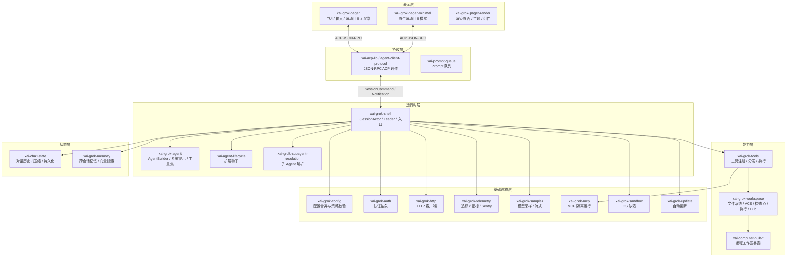
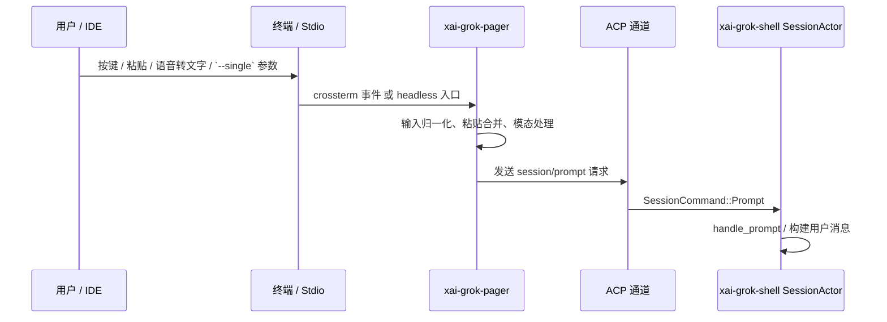
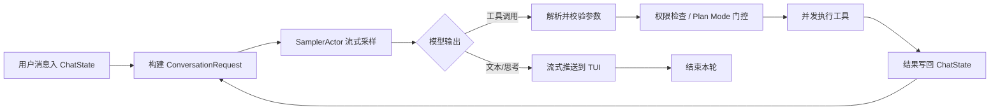
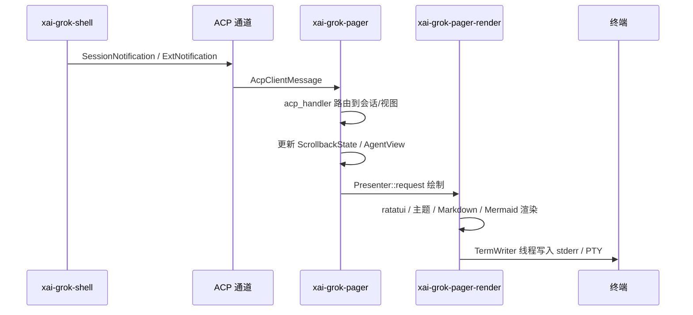
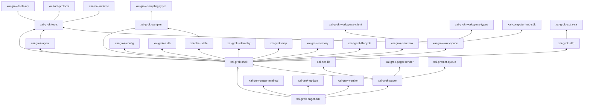

# Grok Build 软件架构与流程文档

> 本文件基于仓库 `crates/` 下源码结构、根 `Cargo.toml`、`README.md` 以及各 crate 的 `Cargo.toml` / `lib.rs` 整理，描述 Grok Build（`grok` CLI/TUI）的整体架构、核心数据流与 crate 职责。
>
> *文档生成时间：2026-08-02*

---

## 1. 项目概述

**Grok Build** 是 SpaceXAI 的终端 AI 编程助手，以全屏 TUI（Terminal User Interface）形式运行，同时支持无头（headless）、stdio、Leader/Follower、Serve 以及 ACP（Agent Client Protocol）嵌入式等多种执行模式。

核心能力：

- 代码库理解与多语言代码图索引
- 文件编辑、Shell 命令执行、Web 搜索、图片/视频生成
- 长会话管理、持久化、压缩、回滚与跨会话记忆
- MCP（Model Context Protocol）服务器与插件扩展
- 子 Agent（Subagent）编排与计划模式（Plan Mode）
- Computer Hub 远程工作区暴露
- 多模态输入（语音、图片）、Markdown/Mermaid 终端渲染

---

## 2. 仓库布局

```text
grok-build/
├── Cargo.toml                 # 自动生成的工作区根，只读
├── rust-toolchain.toml        # 固定 Rust 工具链
├── clippy.toml / rustfmt.toml # 代码风格与 lint
├── bin/protoc                 # DotSlash 封装的 protoc
├── crates/
│   ├── build/                 # 构建期工具（proto codegen）
│   ├── codegen/               # 主体 CLI/TUI crate 闭包（~60 个 crate）
│   └── common/                # 共享叶子 crate（工具协议、熔断、tracing 等）
├── prod/mc/                   # 生产环境相关小 crate
└── third_party/               # 内嵌上游源码（Mermaid 图表栈等）
```

### 2.1 Crate 分类速查

| 分类 | 主要 crate | 说明 |
|------|------------|------|
| **构建期** | `xai-proto-build` | Proto 定义转 Rust 代码生成器 |
| **入口 / TUI** | `xai-grok-pager-bin`、`xai-grok-pager`、`xai-grok-pager-render`、`xai-grok-pager-minimal`、`xai-ratatui-inline`、`xai-ratatui-textarea` | 可执行入口、TUI 逻辑、渲染原语、minimal 原生滚动模式、ratatui 内联/多行输入适配 |
| **ACP / 协议** | `xai-acp-lib`、`xai-prompt-queue`、`xai-hooks-plugins-types`、`agent-client-protocol`（外部） | JSON-RPC 风格 ACP 通道、Prompt 队列、Hook/插件协议类型 |
| **Agent 运行时** | `xai-grok-shell`、`xai-grok-shell-base`、`xai-grok-shell-session-support`、`xai-agent-lifecycle`、`xai-grok-subagent-resolution` | `SessionActor`、运行模式入口、生命周期扩展钩子、子 Agent 解析 |
| **Agent 定义** | `xai-grok-agent` | `AgentBuilder`、`.grok/agents/*.md` 解析、系统提示、工具集 |
| **工具系统** | `xai-grok-tools`、`xai-grok-tools-api`、`xai-tool-protocol`、`xai-tool-runtime`、`xai-tool-types` | 内置工具实现、工具协议/运行时/类型定义 |
| **Workspace** | `xai-grok-workspace`、`xai-grok-workspace-client`、`xai-grok-workspace-types`、`xai-fast-worktree`、`xai-gix-status`、`xai-hunk-tracker` | 本地工作区宿主、VCS、执行、检查点、Computer Hub 客户端、hunk 追踪 |
| **Chat / 采样** | `xai-chat-state`、`xai-grok-sampler`、`xai-grok-sampling-types`、`xai-grok-models`、`xai-token-estimation` | 会话状态 Actor、模型采样、采样类型、默认模型 ID、token 估算 |
| **配置 / 认证 / HTTP** | `xai-grok-config`、`xai-grok-config-types`、`xai-grok-auth`、`xai-grok-http`、`xai-grok-extra-ca`、`xai-grok-env`、`xai-grok-paths`、`xai-grok-version`、`xai-grok-update`、`xai-grok-secrets` | 配置合并与签名校验、认证、HTTP 客户端、版本/更新、敏感信息脱敏 |
| **MCP / 插件 / 钩子** | `xai-grok-mcp`、`xai-grok-hooks`、`xai-grok-plugin-marketplace`、`xai-hooks-plugins-types`、`xai-computer-hub-*` | MCP 服务器隔离运行、钩子系统、插件市场、Computer Hub SDK/MCP 适配器 |
| **渲染 / UI 基础** | `xai-grok-markdown`、`xai-grok-markdown-core`、`xai-grok-mermaid` | 终端 Markdown 流式渲染、Mermaid 图表转 PNG |
| **数据 / 持久化** | `xai-grok-memory`、`xai-sqlite-journal`、`xai-grok-shared`、`xai-file-utils`、`xai-fsnotify` | 跨会话记忆、SQLite journal、共享类型、本地事件采集、文件系统事件 |
| **遥测 / 崩溃** | `xai-grok-telemetry`、`xai-mixpanel`、`xai-crash-handler`、`xai-tracing`、`xai-tracing-macros` | 产品事件、Mixpanel、Sentry、OpenTelemetry、崩溃捕获、tracing 工具宏 |
| **其它辅助** | `xai-codebase-graph`、`xai-grok-voice`、`xai-grok-announcements`、`xai-grok-sandbox`、`xai-system-power`、`xai-tty-utils`、`xai-workflow`、`ptyctl`、`ptyctl-cli` | 代码图索引、语音听写、公告、OS 沙箱、电源事件、TTY 工具、Rhai 工作流、PTY 控制 |
| **通用底层** | `xai-circuit-breaker`、`xai-grok-compaction`、`xai-interjection-core`、`xai-test-utils` | 熔断、对话上下文压缩、中断处理、测试工具 |
| **生产** | `prod/mc/cli-chat-proxy-types` | 生产环境相关类型 |
| **第三方** | `third_party/dagre_rust`、`graphlib_rust`、`mermaid-to-svg`、`ordered_hashmap` | 内嵌上游源码 |

---

## 3. 高层架构

Grok Build 采用**分层 actor 架构**，同一套 `xai-grok-shell` 运行时支撑所有执行模式：

- **表示层（Presentation）**：`xai-grok-pager` 负责 TUI；`xai-grok-pager-minimal` 提供原生滚动回显模式；headless/stdio 模式绕过 TUI，直接通过 ACP 与运行时通信。
- **协议层（Protocol）**：`xai-acp-lib` 与外部 `agent-client-protocol` 提供 JSON-RPC 风格的 ACP 通道；`xai-prompt-queue` 负责 Prompt 队列。
- **运行时层（Runtime）**：`xai-grok-shell` 持有 `SessionActor`、工具桥、采样器句柄、Leader/ACP 适配器；`xai-agent-lifecycle` 提供扩展钩子。
- **能力层（Capabilities）**：`xai-grok-tools` + `xai-grok-workspace` 提供文件、终端、搜索、Web、MCP、检查点等具体能力；`xai-computer-hub-*` 支持远程工作区暴露。
- **状态层（State）**：`xai-chat-state` 管理对话历史；`xai-grok-memory` 管理跨会话记忆。
- **基础设施层（Infrastructure）**：配置、认证、HTTP、遥测、崩溃处理、tracing、沙箱、版本更新等。


```mermaid
flowchart TB
    subgraph Presentation["表示层"]
        PAGER["xai-grok-pager\nTUI / 输入 / 滚动回显 / 渲染"]
        MINI["xai-grok-pager-minimal\n原生滚动回显模式"]
        RENDER["xai-grok-pager-render\n渲染原语 / 主题 / 组件"]
    end

    subgraph Protocol["协议层"]
        ACP["xai-acp-lib / agent-client-protocol\nJSON-RPC ACP 通道"]
        PQ["xai-prompt-queue\nPrompt 队列"]
    end

    subgraph Runtime["运行时层"]
        SHELL["xai-grok-shell\nSessionActor / Leader / 入口"]
        AGENT["xai-grok-agent\nAgentBuilder / 系统提示 / 工具集"]
        LIFE["xai-agent-lifecycle\n扩展钩子"]
        SUB["xai-grok-subagent-resolution\n子 Agent 解析"]
    end

    subgraph Capabilities["能力层"]
        TOOLS["xai-grok-tools\n工具注册 / 分发 / 执行"]
        WS["xai-grok-workspace\n文件系统 / VCS / 检查点 / 执行 / Hub"]
        HUB["xai-computer-hub-*\n远程工作区暴露"]
    end

    subgraph State["状态层"]
        CHAT["xai-chat-state\n对话历史 / 压缩 / 持久化"]
        MEM["xai-grok-memory\n跨会话记忆 / 向量搜索"]
    end

    subgraph Infra["基础设施层"]
        CFG["xai-grok-config\n配置合并与策略校验"]
        AUTH["xai-grok-auth\n认证抽象"]
        HTTP["xai-grok-http\nHTTP 客户端"]
        TEL["xai-grok-telemetry\n追踪 / 指标 / Sentry"]
        SAMPLER["xai-grok-sampler\n模型采样 / 流式"]
        MCP["xai-grok-mcp\nMCP 隔离运行"]
        SANDBOX["xai-grok-sandbox\nOS 沙箱"]
        UPDATE["xai-grok-update\n自动更新"]
    end

    PAGER <-->|ACP JSON-RPC| ACP
    MINI <-->|ACP JSON-RPC| ACP
    ACP <-->|SessionCommand / Notification| SHELL
    SHELL --> AGENT
    SHELL --> LIFE
    SHELL --> SUB
    SHELL --> SAMPLER
    SHELL --> TOOLS
    TOOLS --> WS
    TOOLS --> MCP
    WS --> HUB
    SHELL --> CHAT
    SHELL --> MEM
    SHELL --> CFG
    SHELL --> AUTH
    SHELL --> HTTP
    SHELL --> TEL
    SHELL --> SANDBOX
    SHELL --> UPDATE
```

---

## 4. 执行模式

Grok Build 支持多种运行形态，全部收敛到同一套 `xai-grok-shell` 运行时：

| 模式 | 入口 | 说明 |
|------|------|------|
| **交互式 TUI** | `grok` | 全屏终端界面，默认模式 |
| **单轮 Headless** | `grok -p "prompt"` / `--single` | 单条提示，输出到 stdout 后退出 |
| **Headless** | `grok agent headless` | 无 UI，通过 relay WebSocket 与后端交互 |
| **Stdio** | `grok agent stdio` | 标准输入输出上的 ACP，适合 IDE/脚本 |
| **Leader** | `grok agent leader` | 单机常驻 Leader 进程，Follower 通过 Unix socket 连接 |
| **Serve** | `grok agent serve` | 提供 WebSocket 服务端点 |
| **Workspace 暴露** | `grok workspace start\|status\|pause\|resume\|stop` | 将本地工作区暴露到 Computer Hub（按账号特性门控） |
| **Leader 管理** | `grok leader list\|info\|kill` | 查看/终止 Leader 进程 |
| **ACP 嵌入** | `xai-acp-lib` | 编辑器/插件通过 ACP 协议嵌入 Agent |

`xai-grok-pager-bin/src/main.rs` 负责解析 CLI 参数并路由到对应入口；TUI 路径调用 `xai_grok_pager::app::run`，非 TUI 路径调用 `xai_grok_shell::agent::app::{run_headless, run_stdio_agent, run_leader, run_serve}` 等。

---

## 5. 核心数据流

### 5.1 用户输入 → Agent 运行


```mermaid
sequenceDiagram
    participant User as 用户 / IDE
    participant Term as 终端 / Stdio
    participant Pager as xai-grok-pager
    participant ACP as ACP 通道
    participant Shell as xai-grok-shell SessionActor

    User->>Term: 按键 / 粘贴 / 语音转文字 / `--single` 参数
    Term->>Pager: crossterm 事件 或 headless 入口
    Pager->>Pager: 输入归一化、粘贴合并、模态处理
    Pager->>ACP: 发送 session/prompt 请求
    ACP->>Shell: SessionCommand::Prompt
    Shell->>Shell: handle_prompt / 构建用户消息
```

### 5.2 Agent 单轮循环（Turn Loop）

每一轮用户输入会在 `SessionActor::process_conversation_turn`（`crates/codegen/xai-grok-shell/src/session/acp_session_impl/turn.rs`）中反复采样，直到模型不再请求工具或触发结束条件：


```mermaid
flowchart LR
    A[用户消息入 ChatState] --> B[构建 ConversationRequest]
    B --> C[SamplerActor 流式采样]
    C --> D{模型输出}
    D -->|文本/思考| E[流式推送到 TUI]
    D -->|工具调用| F[解析并校验参数]
    F --> G[权限检查 / Plan Mode 门控]
    G --> H[并发执行工具]
    H --> I[结果写回 ChatState]
    I --> B
    E --> J[结束本轮]
```

关键节点：

1. **Tool prep**：`prepare_tool_definitions_timed` 从 `Agent::ToolBridge` 收集工具定义（内置 + MCP），记录 MCP 等待耗时。
2. **Request build**：`ChatStateHandle::build_request` 组装历史消息、系统提示、工具定义与 token 预算。
3. **Sampling**：`xai-grok-sampler` 负责流式、重试、取消、401 刷新、上下文溢出压缩；`sampler_turn.rs` 处理采样事件到会话状态的转换。
4. **Tool execution**：`execute_tool_calls` / `tool_dispatch.rs` 并发调度；同一路径写操作串行化，子 Agent 通过 `task` 工具派生。
5. **Plan Mode**：`enter_plan_mode` / `exit_plan_mode` 工具在计划阶段拦截写操作，用户批准后才继续。
6. **Structured output**：对于不支持原生 JSON Schema 的后端，模型可调用合成工具 `StructuredOutput`，由循环拦截并校验。
7. **Recovery**：401 触发 `RefreshAuthAndResubmit`；上下文窗口超限触发 `CompactAndResubmit`；采样异常由 `DoomLoopSignalCollector` 监控。

### 5.3 Agent 响应 → TUI 渲染


```mermaid
sequenceDiagram
    participant Shell as xai-grok-shell
    participant ACP as ACP 通道
    participant Pager as xai-grok-pager
    participant Render as xai-grok-pager-render

    Shell->>ACP: SessionNotification / ExtNotification
    ACP->>Pager: AcpClientMessage
    Pager->>Pager: acp_handler 路由到会话/视图
    Pager->>Pager: 更新 ScrollbackState / AgentView
    Pager->>Render: Presenter::request 绘制
    Render->>Render: ratatui / 主题 / Markdown / Mermaid 渲染
    Render->>终端: TermWriter 线程写入 stderr / PTY
```

---

## 6. 关键模块详解

### 6.1 表示层：xai-grok-pager

`xai-grok-pager` 是 TUI 主体，核心模块：

| 模块 | 职责 |
|------|------|
| `app` | 事件循环、终端初始化、`app/cli.rs` 参数解析、入口调度 |
| `app::agent_view` | 单个 Agent 的视图模型（会话 + UI 状态） |
| `app::session_startup` | 会话启动、恢复、fork、worktree、sandbox 解析 |
| `scrollback` | 滚动回显：消息块、搜索、选择、转录 |
| `input` | 键盘输入归一化、行编辑器、鼠标滚动 |
| `views` | 提示框、设置、仪表板、模态框、任务窗格等 Widget |
| `slash` | `/` 命令注册与实现（主题、模型、任务、计划等） |
| `acp` | ACP 连接、Leader 桥接、重连恢复 |
| `headless` | `--single` / `-p` 无 UI 单轮输出 |
| `voice` | 语音听写交互 |
| `mcp_cmd` / `plugin_cmd` / `memory_cmd` / `worktree_cmd` / `sessions_cmd` | 各管理子命令 |
| `minimal_api` / `minimal_hook` | `xai-grok-pager-minimal` 的 IoC 接缝 |

渲染流程：

- `Presenter` 合并脏帧、控制绘制节奏、节流流式重绘。
- `PagerTerminal` 基于 `xai_ratatui_inline::Terminal`，通过独立 `TermWriter` 线程写 stderr，避免阻塞 async 事件循环。
- 屏幕模式：`Fullscreen`（备用屏幕）、`Inline`（内联）、`Minimal`（原生滚动回显）。
- 渲染原语与主题位于独立的 `xai-grok-pager-render` crate，供 pager 与 minimal 复用。

### 6.2 运行时层：xai-grok-shell / xai-grok-agent

#### xai-grok-shell

| 模块 | 职责 |
|------|------|
| `session` / `acp_session` | 会话 actor 与 ACP 适配 |
| `session/acp_session_impl/run_loop.rs` | `run_session` 主循环：命令分发、idle 定时器、memory flush、workflow 管理 |
| `session/acp_session_impl/turn.rs` | 单轮循环实现（`process_conversation_turn`） |
| `session/acp_session_impl/sampler_turn.rs` | 采样事件到会话状态的转换 |
| `session/acp_session_impl/tool_calls.rs` | 工具调用解析、权限、执行、结果处理 |
| `session/acp_session_impl/tool_dispatch.rs` | 工具并发调度与写冲突串行化 |
| `session/acp_session_impl/mcp.rs` | MCP 工具初始化与生命周期 |
| `leader` | Leader/Follower IPC、Unix socket、重连、ACP 状态回放 |
| `agent::app` | `run_headless` / `run_stdio_agent` / `run_leader` / `run_serve` 入口 |
| `extensions` | 扩展钩子与中断（interjection）处理 |
| `auth` / `config` / `managed_config` | 认证、配置、托管配置 |
| `relay` / `remote` | Relay WebSocket 与远程工作区连接 |
| `tools` | 对 `xai-grok-tools` 的薄封装 |

#### xai-grok-agent

- 解析 `.grok/agents/*.md` Agent 描述文件；加载优先级为：项目级 `.grok/agents/` > 用户级 `~/.grok/agents/` > 内嵌 bundled cache。
- 内置 Agent 画像：
  - `grok-build`：默认软件工程 Agent
  - `grok-build-concise`：精简输出格式
  - `grok-build-plan`：带计划模式
  - `grok-build-plan-no-subagents`：计划模式但禁止子 Agent
  - `grok-build-ask-user`：带 `ask_user_question`
  - `grok-build-orchestrator`：编排型 Agent，委派子 Agent
  - `codex`：Codex 风格工具集与提示
  - `opencode`：OpenCode 风格工具集
  - `general-purpose` / `explore` / `plan`：子 Agent 类型
  - `browser-use`：网页浏览 Agent
- `AgentBuilder` 组装工具集、技能、记忆、Web/生成工具，最终生成不可变 `Agent`。
- `Agent` 持有 `ToolBridge`，作为会话工具调用的入口。

### 6.3 能力层

#### xai-grok-tools

内置工具按 namespace 组织：

| Namespace | 代表工具 |
|-----------|----------|
| `GrokBuild` | `run_terminal_cmd`、`read_file`、`search_replace`、`list_dir`、`grep`、`kill_task`、`get_task_output`、`wait_tasks`、`task`（子 Agent）、`todo_write`、`scheduler_create/delete/list`、`monitor`、`update_goal`、`workflow`、`web_search`、`web_fetch`、`image_gen`、`image_to_video`、`reference_to_video`、`lsp`、`enter_plan_mode`、`exit_plan_mode`、`ask_user_question`、`search`、`use_tool` … |
| `GrokBuildConcise` | 上述核心工具的精简版 |
| `GrokBuildHashline` | `hashline_read`、`hashline_edit`、`hashline_grep` |
| `Codex` | `apply_patch`、`grep_files`、`list_dir`、`read_file` |
| `OpenCode` | `bash`、`edit`、`glob`、`grep`、`read`、`skill`、`write`、`todo_write` |
| `Memory` | `memory_search`、`memory_get` |
| `MCP` | 运行时由 MCP 服务器动态注册的工具 |

分发流程：

1. `ToolRegistryBuilder::new()` 静态注册内置工具。
2. 运行时 MCP 工具通过 `FinalizedToolset::register_tool` 动态注册。
3. `ToolBridge` 将调用转发到 `FinalizedToolset::call`。
4. `use_tool` 通过 `InnerDispatchForToolset` 再次分发到 MCP 工具，避免外层死锁。

#### xai-grok-workspace

作为本地工作区宿主，职责包括：

- **文件系统**：`AsyncFileSystem` trait，支持 `LocalFs`、`MockFs`、`AcpFsAdapter`；分页目录列表、二进制安全范围读取、模糊搜索、ripgrep 内容搜索、gitignore 处理、worktree 支持。
- **VCS**：Git status、diff、stage、commit、checkout、stash、分支、检查点；`xai-gix-status` 提供受 RLIMIT_NPROC 保护的 gix status；`xai-fast-worktree` 提供 CoW 快速 worktree 创建。
- **执行**：每个 `WorkspaceSession` 持有会话级 `TerminalBackend`，执行 bash、后台任务、监控、定时任务。
- **检查点/回滚**：`FileStateTracker` 捕获提示前后快照；`rewind_to` 恢复文件、hunk、git 状态。
- **权限**：`CapabilityMode` 按 `ToolKind` 过滤工具；权限管理器处理自动/询问/YOLO 模式。
- **Computer Hub**：通过 `hub.rs` / `xai-computer-hub-sdk` 将本地工作区作为 ToolServer 暴露给远程 Hub，支持多会话多路复用。

### 6.4 状态层

#### xai-chat-state

- Actor 化会话状态：`ChatStateActor` 在独立 tokio 任务运行。
- `ChatStateHandle` 用于推送用户/助手/工具结果消息、构建采样请求、记录 token 使用。
- 支持上下文压缩、持久化、剪枝、结构化输出校验。

#### xai-grok-memory

- Markdown 格式跨会话记忆，存储于 `~/.grok/memory/`。
- 基于 SQLite + `sqlite-vec` 的向量搜索与嵌入。
- 文件监听自动同步记忆索引，支持 idle flush 与 dream consolidation。

---

## 7. 基础设施与横切关注点

| Crate | 职责 |
|-------|------|
| `xai-grok-config` | 合并 `config.toml`、`managed_config.toml`、`requirements.toml` 及 macOS MDM 偏好；Ed25519 签名策略校验 |
| `xai-grok-config-types` | 配置相关的纯数据类型（flags、memory、MCP、权限、pool） |
| `xai-grok-auth` | 认证抽象：`AuthCredentialProvider`、`HttpAuth`；可选 `reqwest-middleware` 401 重试层 |
| `xai-grok-http` | 进程级共享 `reqwest` 客户端（含 HTTP/2 保活、池逃逸）、User-Agent 构造 |
| `xai-grok-extra-ca` | 通过 `GROK_EXTRA_CA_BUNDLE` 加载额外 TLS 根证书 |
| `xai-grok-telemetry` | 产品事件、Mixpanel、Sentry、OpenTelemetry、会话指标、unified log |
| `xai-grok-secrets` | 敏感信息脱敏：token、用户路径、URL 敏感部分 |
| `xai-grok-mcp` | MCP 服务器隔离运行、OAuth、transport、工具调用（隔离 `rmcp` 与 `reqwest` 版本） |
| `xai-grok-hooks` | `~/.grok/hooks/` 与工作树 `.grok/hooks/` 的 hook 系统 |
| `xai-grok-plugin-marketplace` | 插件市场与来源管理 |
| `xai-grok-subagent-resolution` | 子 Agent 启动规范解析与 resume identity 校验 |
| `xai-grok-voice` | 流式语音听写 |
| `xai-codebase-graph` | 基于 tree-sitter 的代码图：定义/引用索引，支持 Rust/TS/Python/Go/JS 等 |
| `xai-grok-markdown` / `xai-grok-mermaid` | 终端 Markdown 流式渲染与 Mermaid 图表 |
| `xai-crash-handler` | 崩溃捕获、符号化、终端恢复 |
| `xai-grok-sandbox` | 基于 Landlock/Seatbelt 等内核原语的 OS 级沙箱 |
| `xai-grok-update` | 自动更新检查与二进制替换 |
| `xai-grok-version` | 锁步版本号 |
| `xai-grok-announcements` | 产品公告类型、持久化与展示 |
| `xai-grok-env` / `xai-grok-paths` | 后端环境预设与类型安全路径 |
| `xai-workflow` | Rhai 脚本化动态工作流引擎 |
| `xai-file-utils` / `xai-fsnotify` | 本地事件采集与文件系统事件源 |
| `xai-tracing` / `xai-tracing-macros` | 共享 tracing 工具与计时宏 |

---

## 8. 依赖与层次关系


```mermaid
flowchart BT
    BIN["xai-grok-pager-bin"] --> PAGER["xai-grok-pager"]
    BIN --> MINI["xai-grok-pager-minimal"]
    BIN --> SHELL["xai-grok-shell"]
    BIN --> UPDATE["xai-grok-update"]
    BIN --> VERSION["xai-grok-version"]
    PAGER --> SHELL
    PAGER --> ACP["xai-acp-lib"]
    PAGER --> RENDER["xai-grok-pager-render"]
    PAGER --> PQ["xai-prompt-queue"]
    SHELL --> AGENT["xai-grok-agent"]
    SHELL --> TOOLS["xai-grok-tools"]
    SHELL --> WS["xai-grok-workspace"]
    SHELL --> CHAT["xai-chat-state"]
    SHELL --> SAMPLER["xai-grok-sampler"]
    SHELL --> CFG["xai-grok-config"]
    SHELL --> AUTH["xai-grok-auth"]
    SHELL --> HTTP["xai-grok-http"]
    SHELL --> TEL["xai-grok-telemetry"]
    SHELL --> MCP["xai-grok-mcp"]
    SHELL --> MEM["xai-grok-memory"]
    SHELL --> LIFE["xai-agent-lifecycle"]
    SHELL --> SANDBOX["xai-grok-sandbox"]
    AGENT --> TOOLS
    WS --> TOOLS
    WS --> WSC["xai-grok-workspace-client"]
    WS --> WST["xai-grok-workspace-types"]
    WS --> HUB["xai-computer-hub-sdk"]
    TOOLS --> API["xai-grok-tools-api"]
    TOOLS --> TPROTO["xai-tool-protocol"]
    TOOLS --> TRUN["xai-tool-runtime"]
    CHAT --> SAMPLER
    SAMPLER --> ST["xai-grok-sampling-types"]
    HTTP --> EXTRA["xai-grok-extra-ca"]
```

---

## 9. 构建与开发提示

- 根 `Cargo.toml` 由构建系统生成，**请勿手动修改**；优先编辑各 crate 的 `Cargo.toml`。
- 需要 `rustup` 自动安装 `rust-toolchain.toml` 指定的工具链。
- `bin/protoc` 通过 DotSlash 解析，构建前确保 `dotslash` 在 `PATH` 上。
- 常用命令：

```bash
# 构建并启动 TUI
cargo run -p xai-grok-pager-bin

# 快速检查
cargo check -p xai-grok-pager-bin

# 单 crate 测试
cargo test -p xai-grok-config

# 格式化与 lint
cargo fmt --all
cargo clippy -p xai-grok-pager-bin
```

---

## 10. 术语表

| 术语 | 说明 |
|------|------|
| **ACP** | Agent Client Protocol，JSON-RPC 风格协议，连接 TUI/IDE 与 Agent 运行时 |
| **Turn** | 一次用户输入到模型停止调用工具的完整轮次 |
| **ToolBridge** | `xai-grok-tools` 对外暴露的工具调用入口 |
| **FinalizedToolset** | 根据配置最终生成的可调用工具集合 |
| **Leader/Follower** | 单机常驻 Leader 进程与多个 Follower 客户端的连接模式 |
| **MCP** | Model Context Protocol，外部工具/服务器扩展协议 |
| **YOLO 模式** | 自动批准工具调用，无需用户确认（`--always-approve`） |
| **Checkpoint** | 提示边界处的文件/git 状态快照，用于回滚 |
| **CapabilityMode** | 按 `ToolKind` 限制 Agent 可用工具的能力模式 |
| **Subagent** | 由 `task` 工具派生的子 Agent，可并行执行独立任务 |
| **Plan Mode** | 计划模式，写操作需用户批准后才执行 |
| **Computer Hub** | 将本地工作区作为 ToolServer 暴露给远程服务的机制 |
| **Workspace Exposure** | 通过 Leader/Computer Hub 把本地 workspace 暴露到云端 |
| **Skill** | 项目级 `.grok/skills/` 中定义的可复用 Agent 能力 |
| **Sandbox** | 基于 Landlock/Seatbelt 的文件/网络访问沙箱 |

---

*本文档随代码演进，应定期根据 `crates/` 下的最新实现进行更新。*
