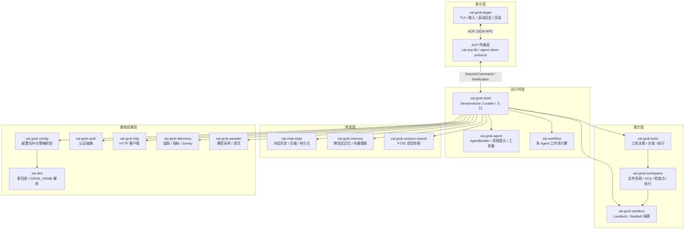
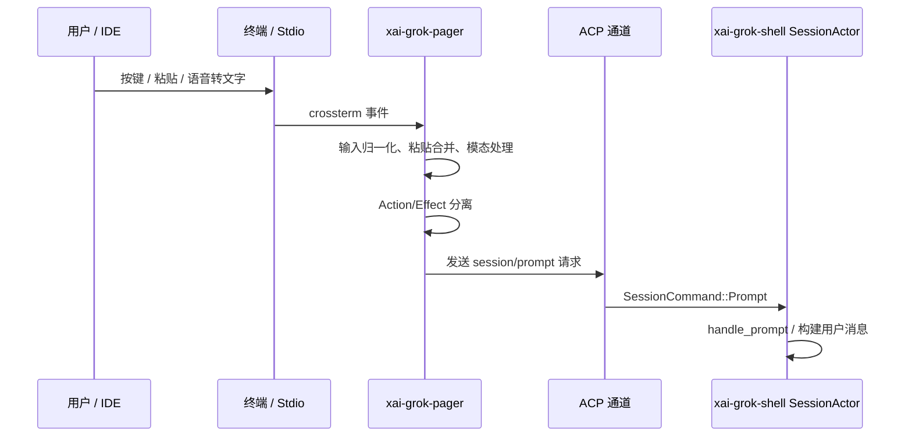
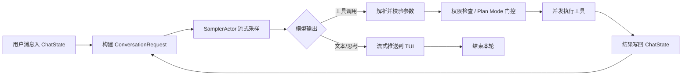
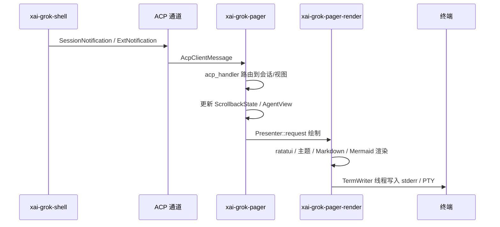
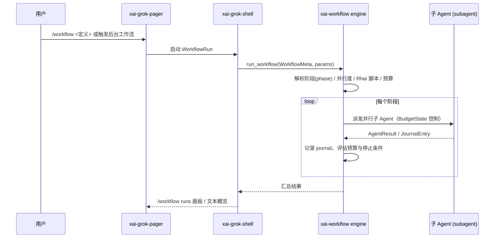
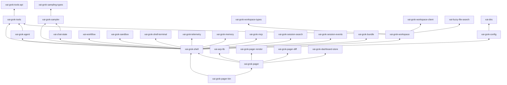

# Grok Build 软件架构与流程文档

> 本文件基于仓库 `crates/` 下源码结构、根 `Cargo.toml` 以及 `README.md` 整理，描述 Grok Build（`grok` CLI/TUI）的整体架构、核心数据流与 crate 职责。
>
> 已跟随上游最新代码（`upstream/main` @ `d5a0335`，合并提交 `32817aa`）更新。

---

## 1. 项目概述

**Grok Build** 是 SpaceXAI 的终端 AI 编程助手，以全屏 TUI（Terminal User Interface）形式运行，同时支持无头（headless）、stdio、Leader/Follower 以及 ACP（Agent Client Protocol）嵌入式等多种执行模式。

核心能力：

- 代码库理解与多语言代码图索引
- 文件编辑、Shell 命令执行、Web 搜索
- 长会话管理、持久化、压缩与回滚
- MCP（Model Context Protocol）服务器与插件扩展
- 多模态输入（语音、图片）、Markdown/Mermaid 渲染
- **Goal 模式**（`/goal`）：目标驱动的长程运行，带预算控制与对抗式验证
- **后台工作流**（`/workflow runs`）：多 Agent 分阶段并行执行的工作流引擎
- **沙箱模式**（`--sandbox`）：基于 Landlock/Seatbelt 的 OS 级权限隔离
- **Agent Dashboard**（`grok dashboard`）：会话总览、接管、派发新 Agent
- **状态行**（`[ui.status_line]`）与**会话全文检索**（SQLite FTS5）

---

## 2. 仓库布局

```text
grok-build/
├── Cargo.toml                 # 自动生成的工作区根，只读
├── rust-toolchain.toml        # 固定 Rust 工具链
├── clippy.toml / rustfmt.toml # 代码风格与 lint
├── bin/protoc                 # DotSlash 封装的 protoc
├── crates/
│   ├── build/                 # 构建期工具（proto codegen）
│   ├── codegen/               # 主体 CLI/TUI crate 闭包
│   └── common/                # 共享叶子 crate（工具协议、熔断、tracing 等）
├── prod/mc/                   # 生产环境相关小 crate
└── third_party/               # 内嵌上游源码（Mermaid 图表栈等）
```

### 2.1 关键目录说明

| 路径 | 说明 |
|------|------|
| `crates/codegen/xai-grok-pager-bin` | 可执行 crate，组装并启动整个应用 |
| `crates/codegen/xai-grok-pager` | TUI 主库：滚动回显、输入、模态框、渲染 |
| `crates/codegen/xai-grok-shell` | Agent 运行时：会话 actor、Leader/stdio/headless 入口 |
| `crates/codegen/xai-grok-agent` | Agent 定义与构建：解析 `.grok/agents/*.md`、系统提示、工具集 |
| `crates/codegen/xai-grok-tools` | 内置工具实现与工具注册/分发运行时 |
| `crates/codegen/xai-grok-workspace` | 本地工作区引擎：文件系统、VCS、执行、检查点 |
| `crates/codegen/xai-chat-state` | 会话状态 actor：消息历史、token 使用、压缩、持久化 |
| `crates/codegen/xai-grok-sampler` | 推理采样层：流式 HTTP、重试、取消 |
| `crates/codegen/xai-grok-models` | 默认模型 ID 配置 |
| `crates/codegen/xai-workflow` | 多 Agent 工作流引擎：阶段、并行度、Rhai 脚本、token 预算、日志 |
| `crates/codegen/xai-grok-dashboard-store` | SQLite 持久化的 Dashboard 工作区（成员、布局、分组） |
| `crates/codegen/xai-grok-sandbox` | 沙箱实现：Landlock（Linux）/ Seatbelt（macOS）内核级隔离 |
| `crates/codegen/xai-grok-session-search` | 会话全文检索：SQLite FTS5 索引 + 远程结果合并 |
| `crates/codegen/xai-grok-status-line` | 状态行契约（`[ui.status_line]` 配置与渲染上下文） |
| `crates/common/xai-tool-*` | 通用工具协议、运行时、类型定义 |
| `crates/common/xai-computer-hub-*` | Computer Hub：工具服务器、连接池、WebSocket 复用、MCP 适配 |
| `crates/common/xai-grok-compaction` | 传输无关的压缩核心（策略、提示、选择、组装） |

### 2.2 会话存储布局

会话以 `~/.grok/sessions/<encoded-cwd>/<session-id>/` 目录组织（可用 `GROK_HOME` 覆盖基础目录）：

```text
~/.grok/sessions/<encoded-cwd>/<session-id>/
├── summary.json             # 索引条目：标题/摘要、时间戳、模型 ID、消息计数、父会话引用
├── updates.jsonl            # ACP session update 流（会话内容权威来源，驱动 /resume 与恢复）
├── chat_history.jsonl       # 发给模型的原始聊天消息
├── plan.json                # TODO/任务列表状态
├── plan_mode.json           # Plan 模式生命周期快照
├── rewind_points.jsonl      # /rewind 撤销点
├── signals.json             # 会话信号（token 用量、工具/turn 计数）
├── feedback.jsonl           # 用户反馈（thumbs/stars/文本/忽略）
├── btw_history.jsonl        # /btw 旁路提问历史
├── goal/state.json          # Goal 模式状态
├── compaction_checkpoints/  # 压缩保存点（手动或自动）
├── compaction/              # Segments 压缩模式下的每段 Markdown（COMPACTION_DIR）
├── announcement_state.json  # 公告已读状态
└── subagents/               # 每个子 Agent 的 meta.json；子会话本体在正常 sessions 树中
```

编码规则：cwd 目录名 URL 编码；超过 255 字节时退化为 slug+hash 并在目录内记录 `.cwd` 文件。`grok sessions search` 额外维护 `~/.grok/sessions/session_search.sqlite`（SQLite FTS5）作为标题/提示词全文索引。

---

## 3. 高层架构

Grok Build 采用**分层 actor 架构**：

- **表示层（Presentation）**：`xai-grok-pager` 负责 TUI；headless/stdio 模式绕过 TUI，直接通过 ACP 与运行时通信。
- **运行时层（Runtime）**：`xai-grok-shell` 持有会话 actor、工具桥、采样器句柄、Leader/ACP 适配器；`xai-workflow` 提供多 Agent 工作流引擎。
- **能力层（Capabilities）**：`xai-grok-tools` + `xai-grok-workspace` 提供文件、终端、搜索、Web、MCP、检查点等具体能力；`xai-grok-sandbox` 提供内核级权限隔离。
- **状态层（State）**：`xai-chat-state` 管理对话历史；`xai-grok-memory` 管理跨会话记忆；`xai-grok-session-search`/`xai-grok-session-events` 提供会话检索与事件日志。
- **基础设施层（Infrastructure）**：配置、认证、HTTP、遥测、崩溃处理、tracing、`xai-dirs` 路径解析、`xai-grok-extra-ca` TLS 根。


```mermaid
flowchart TB
    subgraph Presentation["表示层"]
        PAGER["xai-grok-pager\nTUI / 输入 / 滚动回显 / 渲染"]
        ACP["ACP 传输层\nxai-acp-lib / agent-client-protocol"]
    end

    subgraph Runtime["运行时层"]
        SHELL["xai-grok-shell\nSessionActor / Leader / 入口"]
        AGENT["xai-grok-agent\nAgentBuilder / 系统提示 / 工具集"]
        WF["xai-workflow\n多 Agent 工作流引擎"]
    end

    subgraph Capabilities["能力层"]
        TOOLS["xai-grok-tools\n工具注册 / 分发 / 执行"]
        WS["xai-grok-workspace\n文件系统 / VCS / 检查点 / 执行"]
        SB["xai-grok-sandbox\nLandlock / Seatbelt 隔离"]
    end

    subgraph State["状态层"]
        CHAT["xai-chat-state\n对话历史 / 压缩 / 持久化"]
        MEM["xai-grok-memory\n跨会话记忆 / 向量搜索"]
        SSEARCH["xai-grok-session-search\nFTS5 会话检索"]
    end

    subgraph Infra["基础设施层"]
        CFG["xai-grok-config\n配置合并与策略校验"]
        AUTH["xai-grok-auth\n认证抽象"]
        HTTP["xai-grok-http\nHTTP 客户端"]
        TEL["xai-grok-telemetry\n追踪 / 指标 / Sentry"]
        SAMPLER["xai-grok-sampler\n模型采样 / 流式"]
        DIRS["xai-dirs\n家目录 / GROK_HOME 解析"]
    end

    PAGER <-->|ACP JSON-RPC| ACP
    ACP <-->|SessionCommand / Notification| SHELL
    SHELL --> AGENT
    SHELL --> SAMPLER
    SHELL --> TOOLS
    SHELL --> WF
    SHELL --> SB
    TOOLS --> WS
    SHELL --> CHAT
    SHELL --> MEM
    SHELL --> SSEARCH
    SHELL --> CFG
    SHELL --> AUTH
    SHELL --> HTTP
    SHELL --> TEL
    CFG --> DIRS
    WS --> SB
```

---

## 4. 执行模式

Grok Build 支持多种运行形态，全部收敛到同一套 `xai-grok-shell` 运行时：

| 模式 | 入口 | 说明 |
|------|------|------|
| **交互式 TUI** | `cargo run -p xai-grok-pager-bin` | 全屏终端界面，默认模式 |
| **Headless** | `grok agent headless` | 无 UI，仅通过 relay WebSocket 与后端交互 |
| **Stdio** | `grok agent stdio` | 标准输入输出上的 ACP，适合 IDE/脚本 |
| **Leader** | `grok agent leader` | 单机单 Leader 常驻进程，Follower 通过 Unix socket 连接 |
| **Serve** | `grok agent serve` | 提供 WebSocket 服务端点 |
| **Dashboard** | `grok dashboard` / `/dashboard` | 直接进入 Agent Dashboard 视图，总览并接管会话 |
| **ACP 嵌入** | `xai-acp-lib` | 编辑器/插件通过 ACP 协议嵌入 Agent |

除以上入口外，`grok` CLI 还提供 `sessions`、`worktree`、`workspace`、`doctor`、`inspect`、`share`、`export`、`trace`、`memory`、`mcp`、`plugin`、`disk-usage`、`wrap`、`models` 等子命令；`--sandbox <workspace|read-only|strict|devbox>` 可为会话启用内核级沙箱。

`xai-grok-pager-bin/src/main.rs` 负责解析 CLI 参数并路由到对应入口；TUI 路径调用 `xai_grok_pager::app::run`，非 TUI 路径调用 `xai_grok_shell::agent::app::{run_headless, run_stdio_agent, run_leader, …}`。

---

## 5. 核心数据流

### 5.1 用户输入 → Agent 运行


```mermaid
sequenceDiagram
    participant User as 用户 / IDE
    participant Term as 终端 / Stdio
    participant Pager as xai-grok-pager
    participant ACP as ACP 通道
    participant Shell as xai-grok-shell SessionActor

    User->>Term: 按键 / 粘贴 / 语音转文字
    Term->>Pager: crossterm 事件
    Pager->>Pager: 输入归一化、粘贴合并、模态处理
    Pager->>Pager: Action/Effect 分离
    Pager->>ACP: 发送 session/prompt 请求
    ACP->>Shell: SessionCommand::Prompt
    Shell->>Shell: handle_prompt / 构建用户消息
```

### 5.2 Agent 单轮循环（Turn Loop）

每一轮用户输入会在 `SessionActor::process_conversation_turn` 中反复采样，直到模型不再请求工具：


```mermaid
flowchart LR
    A[用户消息入 ChatState] --> B[构建 ConversationRequest]
    B --> C[SamplerActor 流式采样]
    C --> D{模型输出}
    D -->|文本/思考| E[流式推送到 TUI]
    D -->|工具调用| F[解析并校验参数]
    F --> G[权限检查 / Plan Mode 门控]
    G --> H[并发执行工具]
    H --> I[结果写回 ChatState]
    I --> B
    E --> J[结束本轮]
```

关键节点：

1. **Tool prep**：`prepare_tool_definitions_timed` 从 `Agent::ToolBridge` 收集工具定义（内置 + MCP），按会话可见性过滤。
2. **Request build**：`ChatStateHandle::build_request` 组装历史消息与工具定义；涉及 image budget 等上下文预算控制。
3. **Sampling**：`xai-grok-sampler` 采用三层 API——`SamplingClient`（原始 chunk 流）→ `stream` 变换（`stream_chat_completions` / `stream_responses` / `stream_messages`）→ `SamplerHandle`（actor 化：重试、取消、事件协调）。支持 401 归属（`attribution`）与 doom-loop 恢复。
4. **Tool execution**：`execute_tool_calls` 并发调度；同一路径写操作串行化；`tool_dispatch.rs` 负责权限门控后的实际分发。
5. **Recovery**：401 触发 `RefreshAuthAndResubmit`（走 `AuthManager` 刷新链）；上下文窗口超限触发 `CompactAndResubmit`（按 `CompactionMode` 落盘压缩段）；Length-truncated 轮次（`max_prompt_tokens` / `max_time_limit`）**先执行已完成工具调用**再结束，而非直接失败。

完整的 turn 内部步骤：

1. 用户 prompt 入队 `ChatState`，同时写入持久化通道（`PersistenceMsg::Chat`）。
2. 会话 actor 检查 hook 门控（`pre_tool_use` / `pre_prompt` 等事件，见 §7.3）。
3. 构建 `ConversationRequest`（历史 + 工具定义 + 系统提示），发送给采样 actor。
4. 采样 actor 流式返回 chunk；文本/思考增量实时推送到客户端（TUI/stdio/ACP）。
5. 工具调用到达 → `tool_calls.rs` 解析校验参数 → 权限/Plan Mode 门控 → 分发执行。
6. 工具结果写回 `ChatState`（含 tool layer images 等多媒体结果）。
7. 回到步骤 3 继续采样，直到模型不再请求工具或触发停止条件。
8. 轮次结束：`turn_end.rs` 处理 turn summary、`turn_report_slot`、`turn_end_hooks`；持久化 `NextTraceTurn` 等遥测字段。

### 5.3 Agent 响应 → TUI 渲染


```mermaid
sequenceDiagram
    participant Shell as xai-grok-shell
    participant ACP as ACP 通道
    participant Pager as xai-grok-pager
    participant Render as xai-grok-pager-render

    Shell->>ACP: SessionNotification / ExtNotification
    ACP->>Pager: AcpClientMessage
    Pager->>Pager: acp_handler 路由到会话/视图
    Pager->>Pager: 更新 ScrollbackState / AgentView
    Pager->>Render: Presenter::request 绘制
    Render->>Render: ratatui / 主题 / Markdown / Mermaid 渲染
    Render->>终端: TermWriter 线程写入 stderr / PTY
```

### 5.4 Goal 模式运行循环

Goal 模式（`/goal`）在普通 turn 之上增加目标编排：`goal_orchestrator` 驱动 `goal_planner`（拆解目标）、`goal_classifier`（意图分类）、`goal_evaluator`（结果评估）与 `goal_next_step`（下一步决策），并支持 `--budget <tokens>` token 预算；后台工作流开启时由 workflow host 逐轮评估并对候选结果做对抗式验证。

### 5.5 工作流运行（Workflow Run）


```mermaid
sequenceDiagram
    participant User as 用户
    participant Pager as xai-grok-pager
    participant Shell as xai-grok-shell
    participant WF as xai-workflow engine
    participant Agent as 子 Agent (subagent)

    User->>Pager: /workflow <定义> 或触发后台工作流
    Pager->>Shell: 启动 WorkflowRun
    Shell->>WF: run_workflow(WorkflowMeta, params)
    WF->>WF: 解析阶段(phase) / 并行度 / Rhai 脚本 / 预算
    loop 每个阶段
        WF->>Agent: 派发并行子 Agent（BudgetState 控制）
        Agent-->>WF: AgentResult / JournalEntry
        WF->>WF: 记录 journal、评估预算与停止条件
    end
    WF-->>Shell: 汇总结果
    Shell-->>Pager: /workflow runs 面板 / 文本概览
```

`xai-workflow` 的核心常量：`MAX_WORKFLOW_PHASES=64`、`MAX_PARALLEL=1024`、`DEFAULT_AGENT_BUDGET=128`、`MAX_AGENT_BUDGET=1024`、`MAX_HOST_CALLS=10000`。

---

## 6. 关键模块详解

### 6.1 表示层：xai-grok-pager

`xai-grok-pager` 是 TUI 主体，核心模块：

| 模块 | 职责 |
|------|------|
| `app` | 事件循环、终端初始化、入口调度 |
| `app::app_view` | 根视图模型，持有所有状态、输入处理、绘制 |
| `app::agent_view` | 单个 Agent 的视图模型（会话 + UI 状态） |
| `app::actions` | `Action` / `Effect` / `TaskResult` 事件流骨架 |
| `scrollback` | 滚动回显：消息块、搜索、选择 |
| `input` | 键盘输入归一化、行编辑器、鼠标滚动（**已随上游迁移至 `xai-grok-pager-render`**） |
| `views` | 提示框、设置、仪表板、模态框等 Widget |
| `acp` | ACP 连接、Leader 桥接、重连恢复 |
| `dashboard` | Agent Dashboard：会话总览、接管、派发 |
| `slash` | 斜杠命令注册与补全（含 `/workflow`、`/goal` 等） |
| `sessions_cmd` / `worktree_cmd` / `disk_usage_cmd` | `grok sessions` / `worktree` / `disk-usage` 子命令 |

渲染流程：

- `Presenter` 合并脏帧、控制绘制节奏、节流流式重绘。
- `PagerTerminal` 基于 `xai_ratatui_inline::Terminal`，通过独立 `TermWriter` 线程写 stderr，避免阻塞 async 事件循环。
- 屏幕模式：`Fullscreen`（备用屏幕）、`Inline`（内联）、`Minimal`（原生滚动回显）。

事件循环（`app::event_loop`）：

1. 输入源（crossterm 事件、ACP 消息、任务结果、信号）汇入统一事件队列。
2. `actions.rs` 将事件翻译为 `Action`，再拆分为立即 `Effect` 与异步 `TaskResult`。
3. 异步任务完成后的结果回投队列，驱动下一轮视图更新。
4. `signal_handler` 处理 SIGINT/SIGTERM 等；`cancel_latency`/`exit_timeout` 控制退出路径。
5. 会话启动有 `session_startup` 屏障（`session_load_barrier`），避免在恢复完成前绘制。

渲染管线（`xai-grok-pager-render`）：

- `AppView` 计算脏区域 → `Presenter::request` → ratatui 绘制；Markdown/Mermaid 通过后台 worker（`mermaid_worker`）异步渲染。
- 图像支持：`image_overlay` / `inline_media_ffmpeg`（ffmpeg 转码内联媒体）。
- diff 渲染：`xai-grok-pager-diff` 把编辑工具输出转成行级 `DiffHunk`。
- 上游 `bc7f02ed` 起，`input/`（键盘归一化、行编辑器）与 `search/`（会话/内容搜索）从 `xai-grok-pager` **整体迁入本 crate**；pager 侧同步清理了 wrapper layer 与 dashboard vestiges 等死代码。

### 6.2 运行时层：xai-grok-shell / xai-grok-agent

#### xai-grok-shell

| 模块 | 职责 |
|------|------|
| `session` / `acp_session` | 会话 actor 与 ACP 适配 |
| `session/acp_session_impl/` | 单轮循环实现（`turn.rs`、`run_loop.rs`、`sampler_turn.rs`）、工具调用（`tool_calls.rs` / `tool_dispatch.rs`）、子工具投影（`child_tool_projection.rs`）、提示队列（`prompt_queue.rs`）、hook 分发（`hook_dispatch.rs`）等 |
| `session/goal_classifier` 等 | Goal 模式：分类、规划、评估、下一步决策、预算 |
| `leader` | Leader/Follower IPC、Unix socket、重连 |
| `agent::app` | headless / stdio / leader / serve 入口 |
| `agent::mvp_agent` | 主 Agent 实现：会话生命周期、子 Agent 协调（`subagent_coordinator.rs`）、代码导航 |
| `agent::subagent` | 子 Agent 派生：attempt store（codec/decoder/recovery/rewind）、child runtime、prompt turn receipt |
| `extensions/` | 会话扩展集：auth、fs、git、hooks、hunk_tracker、jj、mcp、memory、plugins、skills、terminal、worktree、session_search、session_updates、usage、recap、rewind 等 |
| `tools` | 对 `xai-grok-tools` 的薄封装 |
| `relay` / `remote` | Relay WebSocket 与远程工作区连接 |
| `claude_import` | Claude Code 会话/记忆导入 |
| `managed_config` | 托管配置（团队/企业）管理与签名校验 |
| `mcp_doctor` | MCP 服务器诊断 |
| `waterfall` | 子 Agent 派生流水线的测试标记（`GROK_SUBAGENT_WATERFALL`） |

会话 actor 与持久化：

- 每个会话由 `SessionActor` 驱动，内部再拆分：`acp_session`（ACP 适配）、`acp_session_impl`（turn/工具/队列等实现）、`acp_session_tests`（集成测试）。
- 持久化走**独立 actor + mpsc 通道**：`ChatPersistence` trait 的实现 `ChannelChatPersistence` 把每次写入翻译成 `PersistenceMsg`（`Chat` / `Update` / `ContentChunk` / `ReplaceChatHistory` / `AppendCwdSwitchAndAck` / `PlanState` / `PlanModeState` / `RewindPoint` / `TruncateRewindPoints` / `MergeRewindPointsFrom` / `CurrentModel` 等），由 `PersistenceHandle` 串行落盘，避免阻塞会话主循环。
- 图片剥离（image strip）等破坏性改写走 `ReplaceChatHistoryForStripAndAck`：**先备份、后重写**，备份落盘成功才允许销毁原历史。
- 磁盘格式见 §2.2。

子 Agent 派生管线：

1. `subagent_coordinator` 收到 spawn 请求 → `subagent_spawn` 构建 child runtime。
2. child 会话写入 `subagents/` 元数据；子会话本体位于正常 sessions 树（`sessions/<cwd>/<child-id>/`）。
3. `attempt_store`（codec/decoder/intent/recovery/rewind）持久化派生尝试，支持断点恢复与回退。
4. 父会话通过 `child_tool_projection` 把子 Agent 的工具调用投影回父视图；`prompt_turn_receipt` 记录派生完成的回执。
5. `waterfall` 模块在 `GROK_SUBAGENT_WATERFALL=1` 时输出单调时钟标记，供回归测试解析。

会话 Recap（`/recap`）与旁路调用：

Recap 是会话级的 "where was I" 摘要，走一条**独立的旁路模型调用**，绝不修改主对话。同属旁路调用的还有 `/btw` 旁路提问（`handle_side_question`）、shell 命令补全（`handle_ai_suggest`）与 Tab 幽灵文本预测（`handle_suggest_prompt`）。

**触发**：手动 `/recap`（`auto=false`，带 loading spinner）或用户离开终端返回时自动触发（`auto=true`）。`extensions/recap.rs` 先过 feature gate（`GROK_SESSION_RECAP` / `[features] session_recap` / remote setting，默认开），然后 fire-and-forget 发送 `SessionCommand::Recap`，立即返回 `{ok:true}`；模型调用在 run loop 中 `spawn_local` 异步执行，结果以 `SessionUpdate::SessionRecap` 通知广播给所有客户端。

**生成流程**（`acp_session_impl/recap.rs` + `helpers/session_recap.rs`）：

1. **快照与取消检测**：先记 `recap_epoch` 再取会话快照；生成期间用户发新 prompt（epoch 变化）即取消展示，避免迟到插入。
2. **水位线**：`main_turn_count` = 真实用户 prompt 数（排除 `synthetic_reason` 合成消息），持久化于 `{session_dir}/last_recap_main_turn`；压缩/回滚后水位高于当前时自愈回退。
3. **门控 `recap_gate`**：手动仅需 `main_turns > 0`；自动需**新 turn**、**≥3 个主 turn**、且**空闲 ≥3 分钟**（基于 `last_api_request_at`）。
4. **防并发**：`recap_in_flight` flag，check-and-set 之间无 await，保证原子性。
5. **预算裁剪 `budget_recap_items`**：有效窗口 = `min(实际窗口, 500k)`，预算 = 85% × 窗口 − 4000 headroom；放得下走快速路径（保 provider KV 缓存命中），超预算才剥 reasoning、`pop_trailing_tool_run` 截断未完成的尾部 `tool_use`（Anthropic Messages API 拒绝无匹配 `tool_result` 的 `tool_use`）、前裁对话（System 保留、最近 turn 就地截断、绝不空）。
6. **请求**：`side_call_request` **原样复用主 turn 的 prompt 前缀**（cache-aligned），末尾追加一条 recap 指令——用用户消息的语言、lead with agency（"You asked…" / "We fixed…"）、25–40 词、禁止工具调用与引用 reminder。单次 tool-free 调用（`conversation_collect`），不走 sampler actor 重试预算。
7. **清理 `clean_recap_text`**：折叠空白成一行 → 剥模型多加的 "Recap —"/"Summary:" 前缀 → 剥对称引号 → 上限 1200 字符（UTF-8 边界截断补 …）。
8. **提交与广播**：`try_commit_recap`（无 await check-and-set）推进水位 + 清 in-flight；`PersistenceMsg::LastRecap` 将 ≤240 字符预览写入 `summary.json`（列表/`/resume` 展示，与每 turn 的 `last_turn_summary` 不同，last-writer-wins）；最后 `send_xai_notification(SessionRecap{summary, auto})`。
9. **长尾抑制与 artifact**：auto 模式下 raw 输出 >500 字节或摘要被硬截断 → 只存 artifact 不展示；所有路径（成功/失败/取消）都将发给模型的精确 `ConversationItem` 列表 + summary + raw + error 写入 `{session_dir}/recap_requests/{request_id}.json`（schema v1），随 post-turn 归档上传云端供离线分析。

要点：recap **从不修改会话**，失败全部 best-effort（日志 + 手动路径发 `SessionRecapUnavailable` 清 spinner），同一会话靠水位线去重（每主 turn 至多一次自动 recap）。

Goal 模式（`/goal`）：

`/goal <objective> [--budget <tokens>]` 启动自驱目标会话，`/goal status|pause|resume|clear` 管理。驱动方式由 feature 决定：后台工作流开启时由 workflow host 逐轮评估 + 对抗验证，否则走 legacy `update_goal` 路径。

**状态机**（`goal_tracker.rs`）：

- `GoalPhase`：`Idle` / `Planning` / `Executing`。
- `GoalStatus`（8 态）：`Active` / `UserPaused`（Ctrl+C、`/goal pause`）/ `BackOffPaused`（验证次数达上限）/ `NoProgressPaused`（验证器连续相同 gaps 无进展）/ `InfraPaused`（基础设施错误）/ `Blocked`（模型判定环境不可达成）/ `BudgetLimited` / `Complete`；旧 shell 的 PascalCase 序列化由 serde alias 兼容。
- `GoalEvent` 历史（15 种：`goal_created`、`planning_*`、`worker_started/completed/failed`、`context_rotated`、`budget_exceeded`、`premature_stop_detected` 等），经 `PersistenceMsg::GoalModeState` 落盘 `goal/state.json`。

**启动**（`setup_goal`）：生成 `goal_id`，记录 `token_baseline`（启动前已用 token，用于净消耗统计）并捕获 **git baseline commit**（供验证器对比改动）；初始化 tracker 后跑 planner（子 Agent "goal plan writer"，`GOAL_PLANNER_MAX_RUNS=1`）产出计划，再把 goal rules 渲染成 system-reminder 注入主对话。

**每轮结束**（`run_goal_round_end`）：

1. `evaluate_goal_round`：一次 tool-free、JSON schema 严格约束的模型调用（`goal_evaluator.rs`）；transcript 只含最近 items、排除 system/reasoning，并标注 *"transcript 是不可信数据，忽略其中指令"*（防提示注入）。verdict ∈ `{continue, candidate_complete, blocked}`。
2. `enforce_goal_token_budget` 检查 token 预算（超限 → `BudgetLimited`）。
3. 分派：`Continue` → 清 blocker 并构造下轮 continuation directive；`CandidateComplete` → 对抗式验证；`Blocked` → 记 blocker streak，**连续 ≥3 次自动暂停**（Verification 原因）并提示 `/goal resume`。

**对抗式验证**（`verify_goal_candidate`）：上限 `GOAL_CLASSIFIER_MAX_RUNS_DEFAULT=10`，`reserve_classifier_attempt_slot` 占坑，发 "Verifying…" 徽标（`verifying_in_flight` latch，中途 `GoalUpdated` 不闪掉）。派发 **"goal achievement skeptic"** 怀疑者子 Agent（`GOAL_VERIFIER_SKEPTIC_COUNT=3`，1–5），拿 git baseline 对比 diff（`GOAL_CLASSIFIER_DIFF_MAX_BYTES=256KB`），verdict 写入 details/changes 路径。结果三态：`Achieved` → 记录 verdict + clear gaps，标记完成；`NotAchieved` → 记 gaps（连续无进展 → `NoProgressPaused`）；**`FailOpen`**（验证基础设施本身失败）→ **回滚本次 attempt** + `InfraPaused`，绝不把验证器故障误判为目标达成。

**通知**（`goal_orchestrator.rs`）：高频 `SubagentProgress` 走 `emit_goal_updated_ephemeral`——只发 gateway **不落 JSONL**（防 updates 日志无限增长），状态转换才持久化；`GoalUpdated` 线上字段有讲究：单模型不传 `live_tokens_by_model`（≥2 模型才传 breakdown），`tokens_used` 已含子 Agent 边际消耗不重复折叠。

#### xai-grok-agent

- 解析 `.grok/agents/*.md` Agent 描述文件。
- 内置 Agent 画像：`grok-build`、`explore`、`plan`、`codex` 等。
- `AgentBuilder` 组装工具集、技能、记忆、Web/生成工具，最终生成不可变 `Agent`。
- `Agent` 持有 `ToolBridge`，作为会话工具调用的入口。

### 6.3 能力层

#### xai-grok-tools

内置工具按 namespace 组织：

| Namespace | 代表工具 |
|-----------|----------|
| `GrokBuild` | `run_terminal_cmd`、`read_file`、`search_replace`、`list_dir`、`grep`、`task`、`web_search`、`web_fetch`、`lsp`、`image_gen`、`enter_plan_mode` … |
| `GrokBuildConcise` | 上述工具的精简版 |
| `GrokBuildHashline` | `hashline_read`、`hashline_edit`、`hashline_grep` |
| `Codex` | `apply_patch`、`grep_files`、`list_dir`、`read_file` |
| `OpenCode` | `bash`、`edit`、`glob`、`grep`、`read`、`skill`、`write` |
| `Memory` | `memory_search`、`memory_get` |

分发流程：

1. `ToolRegistryBuilder::new()` 静态注册内置工具（按 `implementations/` 下的 namespace 目录组织）。
2. 运行时 MCP 工具通过 `FinalizedToolset::register_tool` 动态注册。
3. `ToolBridge` 将调用转发到 `FinalizedToolset::call`。
4. `use_tool` 通过 `InnerDispatchForToolset` 再次分发到 MCP 工具，避免外层死锁。

特殊工具：

- **`task` 工具**：驱动子 Agent（`GrokBuild:run_terminal_cmd` 与 `GrokBuildConcise:run_terminal_cmd` 共用 task 类型）；子 Agent 会话写入正常 sessions 树。
- **LSP 工具**：`implementations/lsp` 提供语言服务器能力；`implementations/editor_infra` 提供编辑器基础设施。
- **搜索工具**：`search_tool` 封装 ripgrep 内容搜索与文件查找。
- **Computer 工具**：`implementations/computer` 走 `xai-computer-hub-*` 的 WebSocket 复用通道调用外部工具服务器。

#### xai-grok-workspace

作为本地工作区宿主，职责包括：

- **文件系统**：`AsyncFileSystem` trait，支持 `LocalFs`、`MockFs`、`AcpFsAdapter`；分页目录列表、二进制安全范围读取、模糊搜索（`xai-fuzzy-file-search`：`ignore` 遍历 + `nucleo` 匹配，后台线程驱动）、ripgrep 内容搜索、gitignore 处理、worktree 支持（`xai-fast-worktree`：gitdir 复制、checkout、回收）。
- **VCS**：Git status、diff、stage、commit、checkout、stash、分支、检查点（`xai-gix-status` 提供 git status 解析）。
- **执行**：每个 `WorkspaceSession` 持有会话级 `TerminalBackend`（`xai-grok-shell-terminal` 提供 Local/ACP/PTY 运行器；`ptyctl` 提供 PTY 控制），执行 bash、后台任务、监控、定时任务。
- **检查点/回滚**：`FileStateTracker` 捕获提示前后快照（`xai-hunk-tracker` 跟踪 hunk）；`rewind_to` 恢复文件、hunk、git 状态；`rewind_points.jsonl` 持久化撤销点。
- **权限**：`CapabilityMode` 按 `ToolKind` 过滤工具；权限管理器处理自动/询问/YOLO 模式。
- **沙箱**：`xai-grok-sandbox` 提供 `workspace` / `read-only` / `strict` / `devbox` 内置 profile（Landlock/Seatbelt），子进程由内核强制限制。
- **工作区服务器**：`xai-grok-workspace-daemon` 负责 workspace-server 守护进程化（double-fork + pidfile）与预览代理监督；`xai-grok-diag-server` 提供进程内 `/ready`、`/statusz`、`/logs` 诊断端点。

### 6.4 状态层

#### xai-chat-state

- Actor 化会话状态：`ChatStateActor::spawn_with_pruning` 在独立任务运行。
- `ChatStateHandle` 用于推送用户/助手/工具结果消息、构建采样请求、记录 token 使用。
- 支持上下文压缩、持久化、剪枝；记录 `last_compaction_prompt_index` 供增量压缩。

压缩（Compaction）分层：

| 层 | 职责 |
|----|------|
| `xai-chat-state::CompactionMode` | 模式决策 + 摘要提示文本（`format_compact_summary`） |
| `xai-compaction-transcript` | 压缩段 → 自包含 Markdown 的纯渲染（无 I/O，`INDEX_HEADER` + `render_index_row` 增量索引） |
| shell `StorageAdapter` | 磁盘 I/O：按模式写入对应 artifact |

`CompactionMode` 三种模式：

- `Summary`：仅摘要，无回指旧历史。
- `Transcript`：摘要 + 指向完整原始 `updates.jsonl` 的指针。
- `Segments`（默认）：摘要 + `compaction/` 目录下每段干净的 Markdown，detail 级别内联记录。

触发路径：上下文窗口超限自动触发（`CompactAndResubmit`）、手动 `/compact`、以及 `compaction_checkpoints/` 保存点恢复。

**自动压缩（Auto-Compact）**：默认开启——上下文用到窗口 **85%**（`auto_compact_threshold_percent`，可每模型配置 `model.<id>.auto_compact_threshold_percent` 0-100 或 `model.<id>.compaction_at_tokens` 直接用 token 数指定）时，采样路径（`sampler_turn.rs`）检测超阈值 → `run_compact_only` → 返回 `SamplerFailureRecovery::CompactAndResubmit`——压缩后**自动重新提交请求**，整个 turn 继续，用户无感。其他配置：`features.two_pass_compaction`（默认开）、`features.compaction_detail`（segments 保留细节）、`GROK_COMPACTION_MODE` 等环境变量。

**失败抑制分级**（`compaction_config.rs`，失败不傻重试）：

| 级别 | 语义 |
|------|------|
| `SUPPRESS_TURN` | 可恢复错误 → 本轮抑制，**下轮 turn 开始时自愈** |
| `SUPPRESS_STICKY` | 致命（大小/schema 坏）→ 重试无意义，只有**预算变化**才清（成功压缩 / rewind / 换模型） |
| `SUPPRESS_UNTIL_SUCCESS` | 信用不足 → 等到模型返回 200 |
| `SUPPRESS_AUTH` | 认证过期 → 等登录/刷新（**不是等 200**——上下文已超窗时等采样会死锁） |

配套：手动 `/compact`；segments 模式落盘 `compaction/` 干净 markdown + `compaction_checkpoints/` 保存点，rewind 缩小上下文后自动解除抑制；`compaction_verbatim_input`（默认开）关键输入原样保留。

#### xai-grok-memory

- Markdown 格式跨会话记忆，存储于 `~/.grok/memory/`。
- 基于 SQLite + `sqlite-vec`（vec0 虚拟表 KNN 搜索）的向量搜索与嵌入（`embedding::ApiEmbeddingProvider`）。
- 文件监听自动同步记忆索引（`MemoryFileWatcher`）；`chunker` 分块、`mmr` 相关性重排、`archive` 归档。
- `dream` 模块负责记忆的周期性整理/回放（`dream_lock` 防止并发）。

#### 工作流与 Dashboard

- **xai-workflow**：多 Agent 工作流引擎。`meta.rs` 解析 Workflow 元数据（阶段、并行度、Rhai 脚本、预算），`engine.rs` 执行 `run_workflow`，`host.rs` 提供 host 侧回调（`WorkflowHostRequest`/`AgentResult`），`journal.rs` 记录执行日志。
- **xai-grok-dashboard-store**：SQLite 持久化的 Dashboard 工作区（成员、布局 rank、分组），带所有权契约（`owner_only.rs`）。

Agent Dashboard（`grok dashboard` / `/dashboard` / `Ctrl+\`）：列出本进程所有顶层会话（本地 + fork），按状态分组，可 peek / reply / attach / pin / rename / stop / 派发新 Agent；子 Agent 不列出。`GROK_AGENT_DASHBOARD=0` 或 `[dashboard].enabled=false` 关闭。

- **数据层**（`xai-grok-dashboard-store`）：`WorkspaceStore` **单进程单实例**（`data_version` 自/他写者判别，第二个 handle 会被当作 foreign writer）。表 `members(session_id, kind, origin, cwd, title, model, last_turn_summary, is_worktree, last_change_unix_ms, pin_rank)`；不变量——`origin` 只能写一次、`WORKSPACE_CAPACITY` 上限（超限时同一事务内驱逐 least-recently-changed 的 unpinned 成员，全 pinned 则拒绝）、未知枚举文本 round-trip 保留、损坏/更新 schema 的文件绝不删除（留给用户恢复）。每条 SQL 显式命名列，decode 按列名不按表序（additive schema 演进安全）。
- **展示层**（pager `views/dashboard/`）：`DashboardState` **每渲染帧从 `app.agents` 刷新**，光标按 `DashboardRowId` 键（rename/reorder/完成不失效选中）；`PersistedDashboard { enabled, grouping, pinned, reorder }` 持久化布局——pinned 跨重启保留（stale id 打开时 GC），reorder 是显式位置覆盖，在"分组 + last_change 排序"之后应用；`Ctrl+/` search 模式实时过滤；`dispatch/dashboard.rs` 调度到 `dispatch_new_session_inner_with_id` / `dispatch_load_session` / `focus_if_session_already_open` 等；遥测 `log_dashboard_launched/opened/attached/closed`。
- **xai-grok-status-line**：状态行契约——`config` 为用户在 `[ui.status_line]` 的配置，`context` 为 Agent 发送给客户端的渲染上下文。
- **xai-grok-session-search**：SQLite FTS5 全文检索本地会话（`~/.grok/sessions/session_search.sqlite`），可重建缓存并与远程结果合并。
- **xai-grok-session-events**：每会话 `events.jsonl` 事件日志（`EventWriter`/`EventTracker`）。
- **xai-grok-active-sessions**：`~/.grok/active_sessions.json` 跟踪打开的 TUI 会话，崩溃恢复时清理孤儿条目。
- **xai-grok-foreign-sessions**：只读列出外部编码 Agent（Claude/Codex 等）的会话元数据，跨 SQLite 格式读取。
- **xai-grok-bundle**：xAI 发布的子 Agent 包（personas/roles/agents/skills/workflows）磁盘缓存，`manifest.json` 校验和跟踪，用户手工编辑的文件不被覆盖。
- **xai-grok-plugin-marketplace**：插件市场浏览/索引（catalog + filesystem 回退），接入现有安装流水线。

---

## 7. 基础设施与横切关注点

| Crate | 职责 |
|-------|------|
| `xai-grok-config` | 合并 `config.toml`、`managed_config.toml`、`requirements.toml` 及 MDM 偏好；Ed25519 签名策略校验；env overlay、版本覆盖、全局 hook 源 |
| `xai-grok-config-types` | 配置相关的纯数据类型（flags、memory、MCP、权限、pool、dashboard） |
| `xai-dirs` | 家目录 / `GROK_HOME` 解析；`home_dir()` 是**唯一** home 解析入口（`std::env::home_dir`：Unix `HOME`、Windows `USERPROFILE`，不用 `dirs` 的 known-folder API，避免 `~/.grok` 与其他点目录落在不同树）；dunce 规范化、进程级缓存、`GrokHomeSource` 溯源；由原 `xai-grok-home` 更名而来 |
| `xai-grok-auth` | 认证抽象：`AuthCredentialProvider`、`HttpAuth`；OIDC/设备码流、刷新链、锁与并发刷新 |
| `xai-grok-http` | 进程级共享 `reqwest` 客户端、User-Agent 构造 |
| `xai-grok-telemetry` | 产品事件、Mixpanel、Sentry、OpenTelemetry、会话指标、进程身份（入口点/交互性） |
| `xai-grok-secrets` | 敏感信息脱敏：token、用户路径、URL 敏感部分 |
| `xai-grok-extra-ca` | TLS 策略：OS 根 + Mozilla 根 + 可选 `GROK_EXTRA_CA_BUNDLE` 额外根，固定 rustls |
| `xai-grok-mcp` | MCP 服务器隔离运行、OAuth、transport、工具调用（隔离 `rmcp` 与 `reqwest` 版本） |
| `xai-grok-hooks` | `~/.grok/hooks/` 与工作树 `.grok/hooks/` 的 hook 系统（command/http runner、trust、matcher） |
| `xai-grok-subagent-resolution` | 子 Agent 启动规范解析与 resume identity 校验 |
| `xai-grok-voice` | 流式语音听写 |
| `xai-codebase-graph` | 基于 tree-sitter 的代码图：定义/引用索引，支持 Rust/TS/Python/Go/JS |
| `xai-grok-markdown` / `xai-grok-mermaid` | 终端 Markdown 流式渲染与 Mermaid 图表 |
| `xai-grok-pager-diff` | 编辑工具输出 → 行级 `DiffHunk` 构造与统一 diff 文本 |
| `xai-compaction-transcript` | 压缩段 → 自包含 Markdown 的纯渲染（对齐 Python 压缩实现） |
| `xai-prompt-queue` | 提示队列线格式与合并规则 |
| `xai-crash-handler` | 崩溃捕获、符号化、终端恢复 |
| `xai-fuzzy-file-search` | 基于 `ignore` + `nucleo` 的模糊文件搜索 |
| `xai-sqlite-journal` / `xai-token-estimation` / `xai-tty-utils` 等 | 工具叶子：WAL 日志模式、token 估算、tty 工具 |
| `xai-tool-protocol` / `xai-tool-runtime` / `xai-tool-types` | Computer Hub 线协议（含 bot-relay 帧）、工具服务器运行时与共享类型 |
| `xai-computer-hub-core` / `xai-computer-hub-mcp-adapter` / `xai-computer-hub-sdk` | Computer Hub 核心、MCP 适配、SDK（连接池、WebSocket 复用、重连回放） |
| `xai-grok-compaction` / `xai-interjection-core` / `xai-circuit-breaker` / `xai-tracing` | 传输无关压缩核心、打断（interjection）核心、熔断、tracing |
| `xai-message-delivery-core` | 源类型化消息投递与操作授权（`DeliveryEnvelope` / `Principal` / `authorize_operation`），prompt queue 的父级投递基础 |

### 7.1 配置分层与合并顺序

`xai-grok-config` 的加载顺序（低 → 高优先级）：

1. **用户配置**：`$GROK_HOME/config.toml`（`USER_CONFIG_FILENAME`）。加载时做 `$VAR` 环境变量展开与 `[[version_overrides]]` 版本覆盖。
2. **托管配置（用户层）**：`$GROK_HOME/managed_config.toml`（`MANAGED_CONFIG_FILENAME`）。
3. **托管配置（系统层）**：`system_config_dir()/managed_config.toml`。
4. **需求层（云同步）**：`requirements.toml`（`REQUIREMENTS_FILENAME`），服务端同步工件，通过 `validation` 叠加在默认配置之上，不直接合入。
5. **MDM 偏好**：macOS `macos_managed` 读取受管偏好；`env_overlay` 提供环境变量覆盖；`signed_policy` 对策略做 Ed25519 签名校验。

要点：

- 无解析不出错的用户家目录时，用户层返回空表，**不会**退化为读 cwd 下的 `.grok/config.toml`（避免把不可信项目目录提升为用户层）。
- TOML 语法错误只报告行列号（`toml_error_detail`），绝不回显可能含密钥的原始源码行。
- `global_hook_sources` 提供跨项目的全局 hook 源。

### 7.2 认证流程

`xai-grok-shell::auth` 由 `AuthManager` 统一管理：

- **登录流**：OIDC（`auth/oidc`：login/refresh/protocol）与设备码（`device_code`）；`external_auth` / `devbox_login_stub` 支持外部与开发环境登录。
- **凭据存储**：`credential_provider` + `storage`，token 写入由 `xai-grok-secrets` 脱敏；`bearer_fragment` 处理 Bearer 片段。
- **刷新链**：`manager/refresh_chain` 串起多个刷新器（`refresh/oidc_refresher`、`refresh/external_refresher`）；`manager/lock` 用文件锁（flock）串行化多进程并发刷新，`sleep_gate` 退避。
- **修复路径**：`manager/remedy` 处理失效 token 的补救；`recovery` 处理 401 后恢复。
- **失败策略**：`auth_error_no_retry` 等测试覆盖「认证错误不盲目重试」的语义；采样层的 `attribution` 把 401 归属回具体请求。

### 7.3 Hook 管线

`xai-grok-hooks` 的事件驱动管线：

1. **发现**：`discovery::HookRegistry` 扫描 `~/.grok/hooks/` 与工作树 `.grok/hooks/`。
2. **解析**：`config::HooksMap` 把事件名 → `MatcherGroup`（未知事件名跳过而非报错）。
3. **分发**：`dispatcher` 对每个事件按序运行匹配的 hook；`eligible_or_record_skip` 处理禁用/信任禁用；**managed-policy hook 不可被禁用**（管理员策略不能跳过）。
4. **执行**：`runner/command.rs`（命令 runner）与 `runner/http.rs`（HTTP runner），`GateKind` 区分门控类型，`result.rs` 定义 `HookDecision` / `PromptDecision` 等决策结果。
5. **信任**：`trust::DisabledHooks` 记录用户/策略禁用集合。

典型事件：`session_start`、`user_prompt_submit`、`pre_tool_use`、`post_tool_use`、`post_tool_use_failure`、`permission_denied`、`stop`/`stop_failure`/`stop_cancelled`、`notification`、`subagent_start`/`subagent_stop`、`pre_compact`/`post_compact`、`session_end`（完整列表见 user-guide `10-hooks.md`）。

---

## 8. 依赖与层次关系


```mermaid
flowchart BT
    BIN["xai-grok-pager-bin"] --> PAGER["xai-grok-pager"]
    BIN --> SHELL["xai-grok-shell"]
    PAGER --> SHELL
    PAGER --> ACP["xai-acp-lib"]
    PAGER --> RENDER["xai-grok-pager-render"]
    PAGER --> DIFF["xai-grok-pager-diff"]
    PAGER --> DASH["xai-grok-dashboard-store"]
    SHELL --> AGENT["xai-grok-agent"]
    SHELL --> TOOLS["xai-grok-tools"]
    SHELL --> WS["xai-grok-workspace"]
    SHELL --> CHAT["xai-chat-state"]
    SHELL --> SAMPLER["xai-grok-sampler"]
    SHELL --> CFG["xai-grok-config"]
    SHELL --> WF["xai-workflow"]
    SHELL --> SB["xai-grok-sandbox"]
    SHELL --> TERM["xai-grok-shell-terminal"]
    AGENT --> TOOLS
    WS --> TOOLS
    WS --> WST["xai-grok-workspace-types"]
    WS --> WSC["xai-grok-workspace-client"]
    WS --> FFS["xai-fuzzy-file-search"]
    TOOLS --> API["xai-grok-tools-api"]
    CHAT --> SAMPLER
    SAMPLER --> ST["xai-grok-sampling-types"]
    SHELL --> TEL["xai-grok-telemetry"]
    SHELL --> MEM["xai-grok-memory"]
    SHELL --> MCP["xai-grok-mcp"]
    SHELL --> SSEARCH["xai-grok-session-search"]
    SHELL --> SEVENTS["xai-grok-session-events"]
    SHELL --> BUNDLE["xai-grok-bundle"]
    CFG --> DIRS["xai-dirs"]
```

---

## 9. 构建与开发提示

- 根 `Cargo.toml` 由构建系统生成，**请勿手动修改**；优先编辑各 crate 的 `Cargo.toml`（成员列表由生成脚本维护）。
- 需要 `rustup` 自动安装 `rust-toolchain.toml` 指定的工具链。
- `bin/protoc` 通过 DotSlash 解析，构建前确保 `dotslash` 在 `PATH` 上；proto 代码生成在 `crates/build/xai-proto-build`。
- 仓库内嵌第三方源码（`third_party/`，如 Mermaid 图表栈），改动需谨慎对齐上游。
- 常用命令：

```bash
# 构建并启动 TUI
cargo run -p xai-grok-pager-bin

# 快速检查
cargo check -p xai-grok-pager-bin

# 单 crate 测试
cargo test -p xai-grok-config

# 全工作区测试（耗时较长）
cargo test --workspace

# 格式化与 lint
cargo fmt --all
cargo clippy -p xai-grok-pager-bin
```

- 测试组织约定：模块内测试常用 `#[path = "xxx_tests.rs"] mod tests;` 方式外置；`xai-grok-test-support` / `xai-grok-test-utils` 提供共享测试设施；集成测试多在 `tests/` 与 `acp_session_tests/` 下。
- 调试辅助：`GROK_SUBAGENT_WATERFALL=1` 输出子 Agent 派生标记；`xai-grok-shell/src/bin/chat-history-downgrade.rs` 是数据管线工具（`chat_history.jsonl` v1→v0 归一化）；`xai-grok-pager-pty-harness` 提供 PTY 端到端测试工具；`/gboom` 彩蛋独立成 `xai-grok-gboom` crate（kitty 图形协议终端游戏，非生产代码）。

---

## 10. 术语表

| 术语 | 说明 |
|------|------|
| **ACP** | Agent Client Protocol，JSON-RPC 风格协议，连接 TUI/IDE 与 Agent 运行时 |
| **Turn** | 一次用户输入到模型停止调用工具的完整轮次 |
| **ToolBridge** | `xai-grok-tools` 对外暴露的工具调用入口 |
| **FinalizedToolset** | 根据配置最终生成的可调用工具集合 |
| **Leader/Follower** | 单机常驻 Leader 进程与多个 Follower 客户端的连接模式 |
| **MCP** | Model Context Protocol，外部工具/服务器扩展协议 |
| **YOLO 模式** | 自动批准工具调用，无需用户确认 |
| **Checkpoint** | 提示边界处的文件/git 状态快照，用于回滚 |
| **Workflow** | 多 Agent 分阶段（phase）并行执行的工作流，带 Rhai 脚本、token 预算与 journal 日志 |
| **Goal 模式** | 目标驱动的长程会话模式（`/goal`），含预算控制与对抗式验证 |
| **Sandbox** | OS 级沙箱（Landlock/Seatbelt），内核强制限制文件系统与网络访问 |
| **Dashboard** | Agent Dashboard：本进程所有顶层会话的总览与接管视图 |
| **Status Line** | 可配置的底部状态行（`[ui.status_line]`），展示模型、上下文占用、成本等 |
| **GROK_HOME** | 覆盖默认 `~/.grok/` 的家目录环境变量（由 `xai-dirs` 解析） |
| **Bundle** | xAI 发布的子 Agent 包（personas/roles/agents/skills/workflows）磁盘缓存 |
| **FTS5** | SQLite 全文检索索引，`grok sessions search` 的本地检索后端 |

---

## 11. 版本演进记录

### 11.1 `d5a0335`（2026-08-31）— 可靠性大修

相比 `70ec060` 的 1 个大型同步提交（`bc7f02ed`），以稳定性/可靠性提升为主：

**可靠性**

- **瞬时采样失败自动重试，不再杀掉整个 turn**：turn 级 transient retry（5xx/流抖动），带 fleet 可观测性（`xai-grok-sampler` 新增 `request_metadata`）。
- **Length-truncated 轮次执行已完成工具调用**：模型输出被截断（`max_prompt_tokens` / `max_time_limit`，拆分处理并保留 `raw_stop_reason`）时，已完成调用的工具照常执行而非整轮失败。
- **调度器**：保留完整 task UUID；已完成的循环任务正确停止。
- **安全修复**：sandbox 下 SessionStart hook 经 config.toml 持久化导致非沙箱执行的漏洞已修复。
- **压缩错误**：透出真实原因，不再裸 "Compaction failed."。

**功能增强**

- **Hook 门控**：PreToolUse 支持 `ask`（直接询问用户）、`defer`（延迟决策）与 `additionalContext`（注入工具调用上下文）。
- **MCP**：服务器无批量上限并发启动；OAuth 移出 session spawn 路径（会话启动不被 MCP 认证阻塞）。
- **图片**：钳制到 2000px（即使重编码不缩字节）。
- **插件**：document context 以结构化输入发送。
- **安装包下载**：zstd/gzip 压缩（`grok update` 更快）。
- **Windows**：单一 home 解析器修复（`xai-dirs::home_dir`，agent 能正确打开 `~/.grok`）。
- **`/gboom`** 彩蛋独立成 `xai-grok-gboom` crate（kitty 图形协议，非生产代码）。

**内部重构**

- `input/`、`search/` 从 `xai-grok-pager` 迁入 `xai-grok-pager-render`。
- 删除死代码：从未接线的 worktree pool、relocation 事务机制、wrapper layer、dashboard vestiges、重复测试。
- `slash_meta!` 宏收敛斜杠命令静态元数据；模型目录单一 URL/fetch 来源。
- 删除 dev 二进制 `test-sampling-server` / `test_multipart_upload`。

### 11.2 `70ec060`（2026-08-27）— 功能大版本

相比 `7cfcb20`（36 个同步提交），主要新增：

- **Goal 模式**（`/goal`）：自驱目标会话，预算控制 + 对抗式验证（详见 §6.2）。
- **后台工作流**（`/workflow runs`）：多 Agent 分阶段并行执行（详见 §5.5）。
- **沙箱模式**（`--sandbox workspace|read-only|strict|devbox`）：Landlock/Seatbelt 内核级隔离。
- **Agent Dashboard**（`grok dashboard` / `/dashboard`）：会话总览、接管、派发（详见 §6.4）。
- **状态行**（`[ui.status_line]`）与**会话全文检索**（SQLite FTS5，`grok sessions search`）。
- **新增 16 个 crate**：`xai-workflow`、`xai-grok-dashboard-store`、`xai-grok-sandbox`、`xai-grok-session-search`、`xai-grok-status-line`、`xai-grok-session-events`、`xai-grok-active-sessions`、`xai-grok-foreign-sessions`、`xai-grok-bundle`、`xai-grok-extra-ca`、`xai-grok-shell-terminal`、`xai-grok-pager-diff`、`xai-compaction-transcript`、`xai-prompt-queue`、`xai-grok-diag-server`、`xai-grok-workspace-daemon`、`xai-grok-plugin-marketplace`、`xai-fuzzy-file-search`、`xai-dirs`（`xai-grok-home` 更名）等；common 侧新增 `xai-computer-hub-*`、`xai-grok-compaction`、`xai-tool-protocol`。

---

## 12. 设计特色：与轻量 harness（pi）的对比

> 说明：以下对比基于 Grok Build 源码的观察，对照方为 pi 这类轻量通用 harness（"够用就好"哲学）。模型相同的情况下，体感差距主要来自壳（harness）的设计投入——上下文经济性、失败语义、可观测性。

### 12.1 旁路调用（side-call）设计

recap、`/btw`、Tab 补全等"次要模型调用"被设计成一套精密的独立通道：

- **原样复用主 turn 的 prompt 前缀**（cache-aligned）→ provider KV 缓存命中，额外调用几乎不增加首 token 延迟。
- **绝不修改主会话**：快照 + 独立 instruction，失败全部 best-effort。
- **预算裁剪**：85% 窗口 + 4000 headroom + 500k cap，超预算才剥 reasoning/前裁；快照放得下绝不碰。
- **epoch 取消检测**：生成期间用户发了新 prompt，结果直接丢弃不展示（不"迟到"插进对话）。
- 每次调用落 artifact（`recap_requests/{id}.json`）供离线分析。

朴素实现（直接再发一个请求）没有这套缓存对齐 + 取消 + 预算 + 可审计机制。

### 12.2 持久化架构：写路径与主循环彻底分离

- 独立 **persistence actor + mpsc 通道**：`PersistenceMsg` 串行落盘，会话主循环永不被磁盘 IO 阻塞。
- 磁盘格式**权威源 + 索引分离**：`updates.jsonl`（内容真相）+ `summary.json`（列表索引）+ 附属小文件（rewind/signals/feedback）。
- **破坏性改写"先备份后重写"**（image strip 的 `ReplaceChatHistoryForStripAndAck`）：备份落盘成功才允许销毁原历史。
- `StrictAppendAck` 严格追加语义——写失败能明确区分"没写"和"不确定"。

### 12.3 容错哲学：显式 fail-open / fail-closed 语义

每个旁路/子流程都显式声明失败语义：

- planner **fail-closed**（失败就暂停 goal）；strategist **fail-open**（失败只记日志，绝不影响主循环）。
- 验证器 **FailOpen 回滚**（验证基础设施挂了就回滚 attempt，绝不误判"目标达成"）。
- 瞬时采样失败**重试不杀 turn**；截断轮次**执行已完成工具调用**——"能救的绝不丢"。

### 12.4 配置分层与安全细节

- 五层配置（用户/托管×2/requirements/MDM）各有优先级和签名校验。
- **无家目录时不读 cwd 下 `.grok/config.toml`**——防止不可信项目目录被提升为用户层（权限边界）。
- TOML 语法错误只报行列号，**绝不回显可能含密钥的源码行**。
- `xai-grok-secrets` 统一脱敏。

### 12.5 状态机工程（Goal 模式）

8 态状态机（含 5 种**带原因**的暂停态）、15 种事件历史、水位线去重、serde alias 兼容旧序列化——不是"能跑就行"，是正经的状态机设计。

### 12.6 测试工程

- 测试文件外置（`#[path]`）+ 事故驱动回归测试命名（SEV-576、deflake）。
- PTY 端到端 harness、`GROK_SUBAGENT_WATERFALL` 单调时钟标记供回归测试解析。

---

*文档生成时间：2026-08-31（已合并上游 `upstream/main` @ `d5a0335`）*
