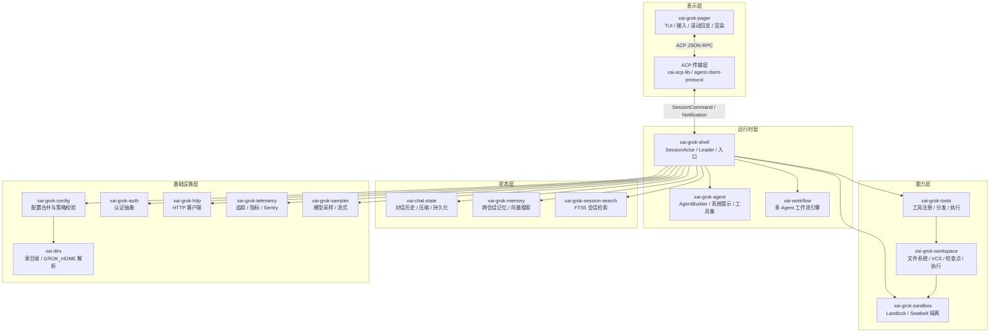
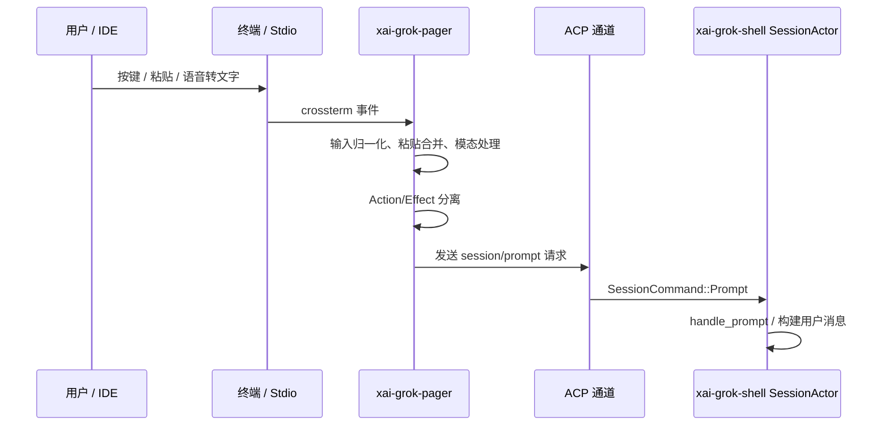
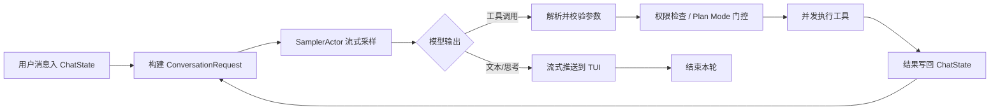
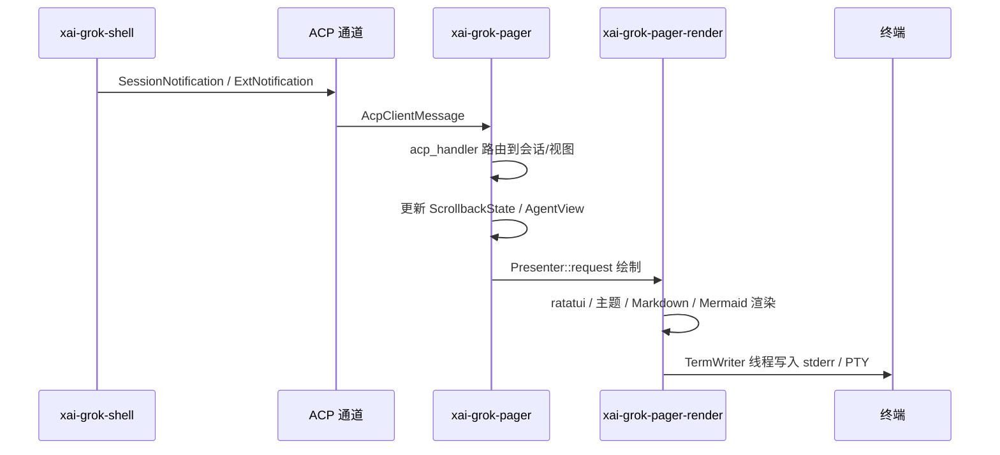
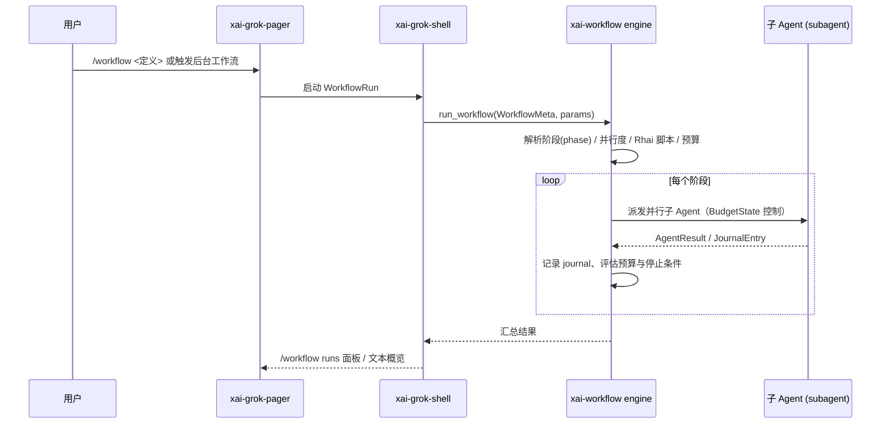
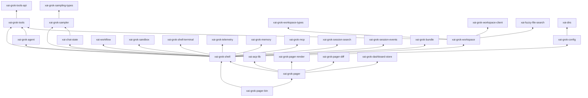

# Grok Build 软件架构与流程文档

> 本文件基于仓库 `crates/` 下源码结构、根 `Cargo.toml` 以及 `README.md` 整理，描述 Grok Build（`grok` CLI/TUI）的整体架构、核心数据流与 crate 职责。
>
> 已跟随上游最新代码（`upstream/main` @ `70ec060`，合并提交 `2d735d3`）更新。

---

## 1. 项目概述

**Grok Build** 是 SpaceXAI 的终端 AI 编程助手，以全屏 TUI（Terminal User Interface）形式运行，同时支持无头（headless）、stdio、Leader/Follower 以及 ACP（Agent Client Protocol）嵌入式等多种执行模式。

核心能力：

- 代码库理解与多语言代码图索引
- 文件编辑、Shell 命令执行、Web 搜索
- 长会话管理、持久化、压缩与回滚
- MCP（Model Context Protocol）服务器与插件扩展
- 多模态输入（语音、图片）、Markdown/Mermaid 渲染
- **Goal 模式**（`/goal`）：目标驱动的长程运行，带预算控制与对抗式验证
- **后台工作流**（`/workflow runs`）：多 Agent 分阶段并行执行的工作流引擎
- **沙箱模式**（`--sandbox`）：基于 Landlock/Seatbelt 的 OS 级权限隔离
- **Agent Dashboard**（`grok dashboard`）：会话总览、接管、派发新 Agent
- **状态行**（`[ui.status_line]`）与**会话全文检索**（SQLite FTS5）

---

## 2. 仓库布局

```text
grok-build/
├── Cargo.toml                 # 自动生成的工作区根，只读
├── rust-toolchain.toml        # 固定 Rust 工具链
├── clippy.toml / rustfmt.toml # 代码风格与 lint
├── bin/protoc                 # DotSlash 封装的 protoc
├── crates/
│   ├── build/                 # 构建期工具（proto codegen）
│   ├── codegen/               # 主体 CLI/TUI crate 闭包
│   └── common/                # 共享叶子 crate（工具协议、熔断、tracing 等）
├── prod/mc/                   # 生产环境相关小 crate
└── third_party/               # 内嵌上游源码（Mermaid 图表栈等）
```

### 2.1 关键目录说明

| 路径 | 说明 |
|------|------|
| `crates/codegen/xai-grok-pager-bin` | 可执行 crate，组装并启动整个应用 |
| `crates/codegen/xai-grok-pager` | TUI 主库：滚动回显、输入、模态框、渲染 |
| `crates/codegen/xai-grok-shell` | Agent 运行时：会话 actor、Leader/stdio/headless 入口 |
| `crates/codegen/xai-grok-agent` | Agent 定义与构建：解析 `.grok/agents/*.md`、系统提示、工具集 |
| `crates/codegen/xai-grok-tools` | 内置工具实现与工具注册/分发运行时 |
| `crates/codegen/xai-grok-workspace` | 本地工作区引擎：文件系统、VCS、执行、检查点 |
| `crates/codegen/xai-chat-state` | 会话状态 actor：消息历史、token 使用、压缩、持久化 |
| `crates/codegen/xai-grok-sampler` | 推理采样层：流式 HTTP、重试、取消 |
| `crates/codegen/xai-grok-models` | 默认模型 ID 配置 |
| `crates/codegen/xai-workflow` | 多 Agent 工作流引擎：阶段、并行度、Rhai 脚本、token 预算、日志 |
| `crates/codegen/xai-grok-dashboard-store` | SQLite 持久化的 Dashboard 工作区（成员、布局、分组） |
| `crates/codegen/xai-grok-sandbox` | 沙箱实现：Landlock（Linux）/ Seatbelt（macOS）内核级隔离 |
| `crates/codegen/xai-grok-session-search` | 会话全文检索：SQLite FTS5 索引 + 远程结果合并 |
| `crates/codegen/xai-grok-status-line` | 状态行契约（`[ui.status_line]` 配置与渲染上下文） |
| `crates/common/xai-tool-*` | 通用工具协议、运行时、类型定义 |
| `crates/common/xai-computer-hub-*` | Computer Hub：工具服务器、连接池、WebSocket 复用、MCP 适配 |
| `crates/common/xai-grok-compaction` | 传输无关的压缩核心（策略、提示、选择、组装） |

---

## 3. 高层架构

Grok Build 采用**分层 actor 架构**：

- **表示层（Presentation）**：`xai-grok-pager` 负责 TUI；headless/stdio 模式绕过 TUI，直接通过 ACP 与运行时通信。
- **运行时层（Runtime）**：`xai-grok-shell` 持有会话 actor、工具桥、采样器句柄、Leader/ACP 适配器；`xai-workflow` 提供多 Agent 工作流引擎。
- **能力层（Capabilities）**：`xai-grok-tools` + `xai-grok-workspace` 提供文件、终端、搜索、Web、MCP、检查点等具体能力；`xai-grok-sandbox` 提供内核级权限隔离。
- **状态层（State）**：`xai-chat-state` 管理对话历史；`xai-grok-memory` 管理跨会话记忆；`xai-grok-session-search`/`xai-grok-session-events` 提供会话检索与事件日志。
- **基础设施层（Infrastructure）**：配置、认证、HTTP、遥测、崩溃处理、tracing、`xai-dirs` 路径解析、`xai-grok-extra-ca` TLS 根。


```mermaid
flowchart TB
    subgraph Presentation["表示层"]
        PAGER["xai-grok-pager\nTUI / 输入 / 滚动回显 / 渲染"]
        ACP["ACP 传输层\nxai-acp-lib / agent-client-protocol"]
    end

    subgraph Runtime["运行时层"]
        SHELL["xai-grok-shell\nSessionActor / Leader / 入口"]
        AGENT["xai-grok-agent\nAgentBuilder / 系统提示 / 工具集"]
        WF["xai-workflow\n多 Agent 工作流引擎"]
    end

    subgraph Capabilities["能力层"]
        TOOLS["xai-grok-tools\n工具注册 / 分发 / 执行"]
        WS["xai-grok-workspace\n文件系统 / VCS / 检查点 / 执行"]
        SB["xai-grok-sandbox\nLandlock / Seatbelt 隔离"]
    end

    subgraph State["状态层"]
        CHAT["xai-chat-state\n对话历史 / 压缩 / 持久化"]
        MEM["xai-grok-memory\n跨会话记忆 / 向量搜索"]
        SSEARCH["xai-grok-session-search\nFTS5 会话检索"]
    end

    subgraph Infra["基础设施层"]
        CFG["xai-grok-config\n配置合并与策略校验"]
        AUTH["xai-grok-auth\n认证抽象"]
        HTTP["xai-grok-http\nHTTP 客户端"]
        TEL["xai-grok-telemetry\n追踪 / 指标 / Sentry"]
        SAMPLER["xai-grok-sampler\n模型采样 / 流式"]
        DIRS["xai-dirs\n家目录 / GROK_HOME 解析"]
    end

    PAGER <-->|ACP JSON-RPC| ACP
    ACP <-->|SessionCommand / Notification| SHELL
    SHELL --> AGENT
    SHELL --> SAMPLER
    SHELL --> TOOLS
    SHELL --> WF
    SHELL --> SB
    TOOLS --> WS
    SHELL --> CHAT
    SHELL --> MEM
    SHELL --> SSEARCH
    SHELL --> CFG
    SHELL --> AUTH
    SHELL --> HTTP
    SHELL --> TEL
    CFG --> DIRS
    WS --> SB
```

---

## 4. 执行模式

Grok Build 支持多种运行形态，全部收敛到同一套 `xai-grok-shell` 运行时：

| 模式 | 入口 | 说明 |
|------|------|------|
| **交互式 TUI** | `cargo run -p xai-grok-pager-bin` | 全屏终端界面，默认模式 |
| **Headless** | `grok agent headless` | 无 UI，仅通过 relay WebSocket 与后端交互 |
| **Stdio** | `grok agent stdio` | 标准输入输出上的 ACP，适合 IDE/脚本 |
| **Leader** | `grok agent leader` | 单机单 Leader 常驻进程，Follower 通过 Unix socket 连接 |
| **Serve** | `grok agent serve` | 提供 WebSocket 服务端点 |
| **Dashboard** | `grok dashboard` / `/dashboard` | 直接进入 Agent Dashboard 视图，总览并接管会话 |
| **ACP 嵌入** | `xai-acp-lib` | 编辑器/插件通过 ACP 协议嵌入 Agent |

除以上入口外，`grok` CLI 还提供 `sessions`、`worktree`、`workspace`、`doctor`、`inspect`、`share`、`export`、`trace`、`memory`、`mcp`、`plugin`、`disk-usage`、`wrap`、`models` 等子命令；`--sandbox <workspace|read-only|strict|devbox>` 可为会话启用内核级沙箱。

`xai-grok-pager-bin/src/main.rs` 负责解析 CLI 参数并路由到对应入口；TUI 路径调用 `xai_grok_pager::app::run`，非 TUI 路径调用 `xai_grok_shell::agent::app::{run_headless, run_stdio_agent, run_leader, …}`。

---

## 5. 核心数据流

### 5.1 用户输入 → Agent 运行


```mermaid
sequenceDiagram
    participant User as 用户 / IDE
    participant Term as 终端 / Stdio
    participant Pager as xai-grok-pager
    participant ACP as ACP 通道
    participant Shell as xai-grok-shell SessionActor

    User->>Term: 按键 / 粘贴 / 语音转文字
    Term->>Pager: crossterm 事件
    Pager->>Pager: 输入归一化、粘贴合并、模态处理
    Pager->>Pager: Action/Effect 分离
    Pager->>ACP: 发送 session/prompt 请求
    ACP->>Shell: SessionCommand::Prompt
    Shell->>Shell: handle_prompt / 构建用户消息
```

### 5.2 Agent 单轮循环（Turn Loop）

每一轮用户输入会在 `SessionActor::process_conversation_turn` 中反复采样，直到模型不再请求工具：


```mermaid
flowchart LR
    A[用户消息入 ChatState] --> B[构建 ConversationRequest]
    B --> C[SamplerActor 流式采样]
    C --> D{模型输出}
    D -->|文本/思考| E[流式推送到 TUI]
    D -->|工具调用| F[解析并校验参数]
    F --> G[权限检查 / Plan Mode 门控]
    G --> H[并发执行工具]
    H --> I[结果写回 ChatState]
    I --> B
    E --> J[结束本轮]
```

关键节点：

1. **Tool prep**：`prepare_tool_definitions_timed` 从 `Agent::ToolBridge` 收集工具定义（内置 + MCP）。
2. **Request build**：`ChatStateHandle::build_request` 组装历史消息与工具定义。
3. **Sampling**：`xai-grok-sampler` 负责流式、重试、取消、401 刷新、上下文溢出压缩。
4. **Tool execution**：`execute_tool_calls` 并发调度；同一路径写操作串行化。
5. **Recovery**：401 触发 `RefreshAuthAndResubmit`；上下文窗口超限触发 `CompactAndResubmit`。

### 5.3 Agent 响应 → TUI 渲染


```mermaid
sequenceDiagram
    participant Shell as xai-grok-shell
    participant ACP as ACP 通道
    participant Pager as xai-grok-pager
    participant Render as xai-grok-pager-render

    Shell->>ACP: SessionNotification / ExtNotification
    ACP->>Pager: AcpClientMessage
    Pager->>Pager: acp_handler 路由到会话/视图
    Pager->>Pager: 更新 ScrollbackState / AgentView
    Pager->>Render: Presenter::request 绘制
    Render->>Render: ratatui / 主题 / Markdown / Mermaid 渲染
    Render->>终端: TermWriter 线程写入 stderr / PTY
```

### 5.4 Goal 模式运行循环

Goal 模式（`/goal`）在普通 turn 之上增加目标编排：`goal_orchestrator` 驱动 `goal_planner`（拆解目标）、`goal_classifier`（意图分类）、`goal_evaluator`（结果评估）与 `goal_next_step`（下一步决策），并支持 `--budget <tokens>` token 预算；后台工作流开启时由 workflow host 逐轮评估并对候选结果做对抗式验证。

### 5.5 工作流运行（Workflow Run）


```mermaid
sequenceDiagram
    participant User as 用户
    participant Pager as xai-grok-pager
    participant Shell as xai-grok-shell
    participant WF as xai-workflow engine
    participant Agent as 子 Agent (subagent)

    User->>Pager: /workflow <定义> 或触发后台工作流
    Pager->>Shell: 启动 WorkflowRun
    Shell->>WF: run_workflow(WorkflowMeta, params)
    WF->>WF: 解析阶段(phase) / 并行度 / Rhai 脚本 / 预算
    loop 每个阶段
        WF->>Agent: 派发并行子 Agent（BudgetState 控制）
        Agent-->>WF: AgentResult / JournalEntry
        WF->>WF: 记录 journal、评估预算与停止条件
    end
    WF-->>Shell: 汇总结果
    Shell-->>Pager: /workflow runs 面板 / 文本概览
```

`xai-workflow` 的核心常量：`MAX_WORKFLOW_PHASES=64`、`MAX_PARALLEL=1024`、`DEFAULT_AGENT_BUDGET=128`、`MAX_AGENT_BUDGET=1024`、`MAX_HOST_CALLS=10000`。

---

## 6. 关键模块详解

### 6.1 表示层：xai-grok-pager

`xai-grok-pager` 是 TUI 主体，核心模块：

| 模块 | 职责 |
|------|------|
| `app` | 事件循环、终端初始化、入口调度 |
| `app::app_view` | 根视图模型，持有所有状态、输入处理、绘制 |
| `app::agent_view` | 单个 Agent 的视图模型（会话 + UI 状态） |
| `app::actions` | `Action` / `Effect` / `TaskResult` 事件流骨架 |
| `scrollback` | 滚动回显：消息块、搜索、选择 |
| `input` | 键盘输入归一化、行编辑器、鼠标滚动 |
| `views` | 提示框、设置、仪表板、模态框等 Widget |
| `acp` | ACP 连接、Leader 桥接、重连恢复 |
| `dashboard` | Agent Dashboard：会话总览、接管、派发 |
| `slash` | 斜杠命令注册与补全（含 `/workflow`、`/goal` 等） |
| `sessions_cmd` / `worktree_cmd` / `disk_usage_cmd` | `grok sessions` / `worktree` / `disk-usage` 子命令 |

渲染流程：

- `Presenter` 合并脏帧、控制绘制节奏、节流流式重绘。
- `PagerTerminal` 基于 `xai_ratatui_inline::Terminal`，通过独立 `TermWriter` 线程写 stderr，避免阻塞 async 事件循环。
- 屏幕模式：`Fullscreen`（备用屏幕）、`Inline`（内联）、`Minimal`（原生滚动回显）。

### 6.2 运行时层：xai-grok-shell / xai-grok-agent

#### xai-grok-shell

| 模块 | 职责 |
|------|------|
| `session` / `acp_session` | 会话 actor 与 ACP 适配 |
| `session/acp_session_impl/` | 单轮循环实现（`turn.rs`、`run_loop.rs`、`sampler_turn.rs`）、工具调用（`tool_calls.rs` / `tool_dispatch.rs`）、子工具投影（`child_tool_projection.rs`）、提示队列（`prompt_queue.rs`）、hook 分发（`hook_dispatch.rs`）等 |
| `session/goal_classifier` 等 | Goal 模式：分类、规划、评估、下一步决策、预算 |
| `leader` | Leader/Follower IPC、Unix socket、重连 |
| `agent::app` | headless / stdio / leader / serve 入口 |
| `agent::mvp_agent` | 主 Agent 实现：会话生命周期、子 Agent 协调（`subagent_coordinator.rs`）、代码导航 |
| `agent::subagent` | 子 Agent 派生：attempt store（codec/decoder/recovery/rewind）、child runtime、prompt turn receipt |
| `extensions/` | 会话扩展集：auth、fs、git、hooks、hunk_tracker、jj、mcp、memory、plugins、skills、terminal、worktree、session_search、session_updates、usage、recap、rewind 等 |
| `tools` | 对 `xai-grok-tools` 的薄封装 |
| `relay` / `remote` | Relay WebSocket 与远程工作区连接 |
| `claude_import` | Claude Code 会话/记忆导入 |
| `managed_config` | 托管配置（团队/企业）管理与签名校验 |
| `mcp_doctor` | MCP 服务器诊断 |
| `waterfall` | 子 Agent 派生流水线的测试标记（`GROK_SUBAGENT_WATERFALL`） |

#### xai-grok-agent

- 解析 `.grok/agents/*.md` Agent 描述文件。
- 内置 Agent 画像：`grok-build`、`explore`、`plan`、`codex` 等。
- `AgentBuilder` 组装工具集、技能、记忆、Web/生成工具，最终生成不可变 `Agent`。
- `Agent` 持有 `ToolBridge`，作为会话工具调用的入口。

### 6.3 能力层

#### xai-grok-tools

内置工具按 namespace 组织：

| Namespace | 代表工具 |
|-----------|----------|
| `GrokBuild` | `run_terminal_cmd`、`read_file`、`search_replace`、`list_dir`、`grep`、`task`、`web_search`、`web_fetch`、`lsp`、`image_gen`、`enter_plan_mode` … |
| `GrokBuildConcise` | 上述工具的精简版 |
| `GrokBuildHashline` | `hashline_read`、`hashline_edit`、`hashline_grep` |
| `Codex` | `apply_patch`、`grep_files`、`list_dir`、`read_file` |
| `OpenCode` | `bash`、`edit`、`glob`、`grep`、`read`、`skill`、`write` |
| `Memory` | `memory_search`、`memory_get` |

分发流程：

1. `ToolRegistryBuilder::new()` 静态注册内置工具。
2. 运行时 MCP 工具通过 `FinalizedToolset::register_tool` 动态注册。
3. `ToolBridge` 将调用转发到 `FinalizedToolset::call`。
4. `use_tool` 通过 `InnerDispatchForToolset` 再次分发到 MCP 工具，避免外层死锁。

#### xai-grok-workspace

作为本地工作区宿主，职责包括：

- **文件系统**：`AsyncFileSystem` trait，支持 `LocalFs`、`MockFs`、`AcpFsAdapter`；分页目录列表、二进制安全范围读取、模糊搜索（`xai-fuzzy-file-search`）、ripgrep 内容搜索、gitignore 处理、worktree 支持。
- **VCS**：Git status、diff、stage、commit、checkout、stash、分支、检查点。
- **执行**：每个 `WorkspaceSession` 持有会话级 `TerminalBackend`（`xai-grok-shell-terminal` 提供 Local/ACP/PTY 运行器），执行 bash、后台任务、监控、定时任务。
- **检查点/回滚**：`FileStateTracker` 捕获提示前后快照；`rewind_to` 恢复文件、hunk、git 状态。
- **权限**：`CapabilityMode` 按 `ToolKind` 过滤工具；权限管理器处理自动/询问/YOLO 模式。
- **沙箱**：`xai-grok-sandbox` 提供 `workspace` / `read-only` / `strict` / `devbox` 内置 profile（Landlock/Seatbelt），子进程由内核强制限制。
- **工作区服务器**：`xai-grok-workspace-daemon` 负责 workspace-server 守护进程化（double-fork + pidfile）与预览代理监督；`xai-grok-diag-server` 提供进程内 `/ready`、`/statusz`、`/logs` 诊断端点。

### 6.4 状态层

#### xai-chat-state

- Actor 化会话状态：`ChatStateActor::spawn_with_pruning` 在独立任务运行。
- `ChatStateHandle` 用于推送用户/助手/工具结果消息、构建采样请求、记录 token 使用。
- 支持上下文压缩、持久化、剪枝。

#### xai-grok-memory

- Markdown 格式跨会话记忆，存储于 `~/.grok/memory/`。
- 基于 SQLite + `sqlite-vec` 的向量搜索与嵌入。
- 文件监听自动同步记忆索引；`dream` 模块负责记忆的周期性整理/回放。

#### 工作流与 Dashboard

- **xai-workflow**：多 Agent 工作流引擎。`meta.rs` 解析 Workflow 元数据（阶段、并行度、Rhai 脚本、预算），`engine.rs` 执行 `run_workflow`，`host.rs` 提供 host 侧回调（`WorkflowHostRequest`/`AgentResult`），`journal.rs` 记录执行日志。
- **xai-grok-dashboard-store**：SQLite 持久化的 Dashboard 工作区（成员、布局 rank、分组），带所有权契约（`owner_only.rs`）。
- **xai-grok-status-line**：状态行契约——`config` 为用户在 `[ui.status_line]` 的配置，`context` 为 Agent 发送给客户端的渲染上下文。
- **xai-grok-session-search**：SQLite FTS5 全文检索本地会话（`~/.grok/sessions/session_search.sqlite`），可重建缓存并与远程结果合并。
- **xai-grok-session-events**：每会话 `events.jsonl` 事件日志（`EventWriter`/`EventTracker`）。
- **xai-grok-active-sessions**：`~/.grok/active_sessions.json` 跟踪打开的 TUI 会话，崩溃恢复时清理孤儿条目。
- **xai-grok-foreign-sessions**：只读列出外部编码 Agent（Claude/Codex 等）的会话元数据，跨 SQLite 格式读取。
- **xai-grok-bundle**：xAI 发布的子 Agent 包（personas/roles/agents/skills/workflows）磁盘缓存，`manifest.json` 校验和跟踪，用户手工编辑的文件不被覆盖。
- **xai-grok-plugin-marketplace**：插件市场浏览/索引（catalog + filesystem 回退），接入现有安装流水线。

---

## 7. 基础设施与横切关注点

| Crate | 职责 |
|-------|------|
| `xai-grok-config` | 合并 `config.toml`、`managed_config.toml`、`requirements.toml` 及 MDM 偏好；Ed25519 签名策略校验；env overlay、版本覆盖、全局 hook 源 |
| `xai-grok-config-types` | 配置相关的纯数据类型（flags、memory、MCP、权限、pool、dashboard） |
| `xai-dirs` | 家目录 / `GROK_HOME` 解析（`USERPROFILE` 优先、dunce 规范化、进程级缓存）；由原 `xai-grok-home` 更名而来 |
| `xai-grok-auth` | 认证抽象：`AuthCredentialProvider`、`HttpAuth`；OIDC/设备码流、刷新链、锁与并发刷新 |
| `xai-grok-http` | 进程级共享 `reqwest` 客户端、User-Agent 构造 |
| `xai-grok-telemetry` | 产品事件、Mixpanel、Sentry、OpenTelemetry、会话指标、进程身份（入口点/交互性） |
| `xai-grok-secrets` | 敏感信息脱敏：token、用户路径、URL 敏感部分 |
| `xai-grok-extra-ca` | TLS 策略：OS 根 + Mozilla 根 + 可选 `GROK_EXTRA_CA_BUNDLE` 额外根，固定 rustls |
| `xai-grok-mcp` | MCP 服务器隔离运行、OAuth、transport、工具调用（隔离 `rmcp` 与 `reqwest` 版本） |
| `xai-grok-hooks` | `~/.grok/hooks/` 与工作树 `.grok/hooks/` 的 hook 系统（command/http runner、trust、matcher） |
| `xai-grok-subagent-resolution` | 子 Agent 启动规范解析与 resume identity 校验 |
| `xai-grok-voice` | 流式语音听写 |
| `xai-codebase-graph` | 基于 tree-sitter 的代码图：定义/引用索引，支持 Rust/TS/Python/Go/JS |
| `xai-grok-markdown` / `xai-grok-mermaid` | 终端 Markdown 流式渲染与 Mermaid 图表 |
| `xai-grok-pager-diff` | 编辑工具输出 → 行级 `DiffHunk` 构造与统一 diff 文本 |
| `xai-compaction-transcript` | 压缩段 → 自包含 Markdown 的纯渲染（对齐 Python 压缩实现） |
| `xai-prompt-queue` | 提示队列线格式与合并规则 |
| `xai-crash-handler` | 崩溃捕获、符号化、终端恢复 |
| `xai-fuzzy-file-search` | 基于 `ignore` + `nucleo` 的模糊文件搜索 |
| `xai-sqlite-journal` / `xai-token-estimation` / `xai-tty-utils` 等 | 工具叶子：WAL 日志模式、token 估算、tty 工具 |
| `xai-tool-protocol` / `xai-tool-runtime` / `xai-tool-types` | Computer Hub 线协议（含 bot-relay 帧）、工具服务器运行时与共享类型 |
| `xai-computer-hub-core` / `xai-computer-hub-mcp-adapter` / `xai-computer-hub-sdk` | Computer Hub 核心、MCP 适配、SDK（连接池、WebSocket 复用、重连回放） |
| `xai-grok-compaction` / `xai-interjection-core` / `xai-circuit-breaker` / `xai-tracing` | 传输无关压缩核心、打断（interjection）核心、熔断、tracing |

---

## 8. 依赖与层次关系


```mermaid
flowchart BT
    BIN["xai-grok-pager-bin"] --> PAGER["xai-grok-pager"]
    BIN --> SHELL["xai-grok-shell"]
    PAGER --> SHELL
    PAGER --> ACP["xai-acp-lib"]
    PAGER --> RENDER["xai-grok-pager-render"]
    PAGER --> DIFF["xai-grok-pager-diff"]
    PAGER --> DASH["xai-grok-dashboard-store"]
    SHELL --> AGENT["xai-grok-agent"]
    SHELL --> TOOLS["xai-grok-tools"]
    SHELL --> WS["xai-grok-workspace"]
    SHELL --> CHAT["xai-chat-state"]
    SHELL --> SAMPLER["xai-grok-sampler"]
    SHELL --> CFG["xai-grok-config"]
    SHELL --> WF["xai-workflow"]
    SHELL --> SB["xai-grok-sandbox"]
    SHELL --> TERM["xai-grok-shell-terminal"]
    AGENT --> TOOLS
    WS --> TOOLS
    WS --> WST["xai-grok-workspace-types"]
    WS --> WSC["xai-grok-workspace-client"]
    WS --> FFS["xai-fuzzy-file-search"]
    TOOLS --> API["xai-grok-tools-api"]
    CHAT --> SAMPLER
    SAMPLER --> ST["xai-grok-sampling-types"]
    SHELL --> TEL["xai-grok-telemetry"]
    SHELL --> MEM["xai-grok-memory"]
    SHELL --> MCP["xai-grok-mcp"]
    SHELL --> SSEARCH["xai-grok-session-search"]
    SHELL --> SEVENTS["xai-grok-session-events"]
    SHELL --> BUNDLE["xai-grok-bundle"]
    CFG --> DIRS["xai-dirs"]
```

---

## 9. 构建与开发提示

- 根 `Cargo.toml` 由构建系统生成，**请勿手动修改**；优先编辑各 crate 的 `Cargo.toml`。
- 需要 `rustup` 自动安装 `rust-toolchain.toml` 指定的工具链。
- `bin/protoc` 通过 DotSlash 解析，构建前确保 `dotslash` 在 `PATH` 上。
- 常用命令：

```bash
# 构建并启动 TUI
cargo run -p xai-grok-pager-bin

# 快速检查
cargo check -p xai-grok-pager-bin

# 单 crate 测试
cargo test -p xai-grok-config

# 格式化与 lint
cargo fmt --all
cargo clippy -p xai-grok-pager-bin
```

---

## 10. 术语表

| 术语 | 说明 |
|------|------|
| **ACP** | Agent Client Protocol，JSON-RPC 风格协议，连接 TUI/IDE 与 Agent 运行时 |
| **Turn** | 一次用户输入到模型停止调用工具的完整轮次 |
| **ToolBridge** | `xai-grok-tools` 对外暴露的工具调用入口 |
| **FinalizedToolset** | 根据配置最终生成的可调用工具集合 |
| **Leader/Follower** | 单机常驻 Leader 进程与多个 Follower 客户端的连接模式 |
| **MCP** | Model Context Protocol，外部工具/服务器扩展协议 |
| **YOLO 模式** | 自动批准工具调用，无需用户确认 |
| **Checkpoint** | 提示边界处的文件/git 状态快照，用于回滚 |
| **Workflow** | 多 Agent 分阶段（phase）并行执行的工作流，带 Rhai 脚本、token 预算与 journal 日志 |
| **Goal 模式** | 目标驱动的长程会话模式（`/goal`），含预算控制与对抗式验证 |
| **Sandbox** | OS 级沙箱（Landlock/Seatbelt），内核强制限制文件系统与网络访问 |
| **Dashboard** | Agent Dashboard：本进程所有顶层会话的总览与接管视图 |
| **Status Line** | 可配置的底部状态行（`[ui.status_line]`），展示模型、上下文占用、成本等 |
| **GROK_HOME** | 覆盖默认 `~/.grok/` 的家目录环境变量（由 `xai-dirs` 解析） |
| **Bundle** | xAI 发布的子 Agent 包（personas/roles/agents/skills/workflows）磁盘缓存 |
| **FTS5** | SQLite 全文检索索引，`grok sessions search` 的本地检索后端 |

---

*文档生成时间：2026-08-27（已合并上游 `upstream/main` @ `70ec060`）*
