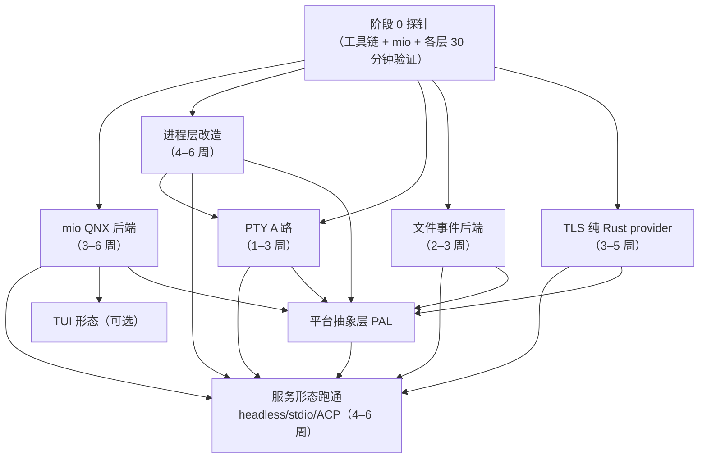

# Grok Build → QNX 8.0（aarch64）移植文档索引

> 目标平台：**QNX 8.0 / aarch64**（Rust target `aarch64-unknown-nto-qnx800`）
> 分析基准：`upstream/main` @ `37949780`
> 本索引是入口；各项分析见下列专文。所有 **[待实测]** 标记项必须在真实 QNX SDP 8.0 上验证。

---

## 1. 文档地图

| 文档 | 内容 | 一句话结论 |
|------|------|-----------|
| [`porting-qnx.md`](./porting-qnx.md) | **总览**：硬阻塞、平台映射表、分层方案（PAL）、6 阶段路线图、风险登记 | 可行，但属"运行时级"移植；先定形态可省一半工作量 |
| [`porting-qnx-mio.md`](./porting-qnx-mio.md) | **mio 后端**：四模块接入点、四方案对比、`poll()` 八难点、实现骨架 | 唯一全局阻塞；先探 epoll 兼容（半天 → 省 3–6 周） |
| [`porting-qnx-process.md`](./porting-qnx-process.md) | **子进程层**：tokio 两条路径、三层风险、PDEATHSIG 替代、探针 | 非阻塞项；真正的坑是 `pre_exec`+PDEATHSIG 这对 Linux 惯用法 |
| [`porting-qnx-pty.md`](./porting-qnx-pty.md) | **PTY/终端**：命令执行（必需）vs TUI（可选）、`portable-pty`、`devc-pty` | 拆成两个目标看，服务形态只需打通 A 路 |
| [`porting-qnx-fsevents.md`](./porting-qnx-fsevents.md) | **文件事件**：`notify` 四处接入点、轮询兜底设计、语义要求 | 最易降级；轮询把硬阻塞变成性能取舍 |
| [`porting-qnx-tls.md`](./porting-qnx-tls.md) | **TLS/加密**：`ring`/`aws-lc-rs` 双 provider、纯 Rust provider 方案、Ed25519 替换 | 推荐纯 Rust provider + `ed25519-dalek`，零 C 依赖 |

---

## 2. 阻塞分级（速查）

| # | 项目 | 分级 | 兜底/替代方案 | 估算 |
|---|------|------|--------------|------|
| 1 | **mio/tokio 无 QNX 后端** | 🔴 **硬阻塞** | 写 `poll()` 后端（无更省事的兜底） | 3–6 周 |
| 2 | `notify` 不支持 QNX | 🟡 可降级 | **轮询**（延迟不敏感） | 2–3 周 |
| 3 | `ring`/`aws-lc-rs` TLS | 🟡 可替代 | 纯 Rust provider / QNX OpenSSL | 3–5 周 |
| 4 | `pre_exec` + `PDEATHSIG` | 🟡 可替代 | `posix_spawn` + channel 断连守卫 | 4–6 周（含 process 层） |
| 5 | `portable-pty` QNX 支持 | 🟡 待探 | 打补丁 / 自研（`ptyctl` 已有基础） | 1–3 周 |
| 6 | 沙箱（Landlock） | 🟢 已降级 | 代码已有"不可用"语义；`procmgr_ability` 可选增强 | 0–1 周 |
| 7 | `/proc`、cgroup、seccomp | 🟢 可禁用 | fallback / `cfg` 门控 | 3–5 天 |
| 8 | 电源管理、剪贴板、音频 | 🟢 可 stub | PAL 注入 no-op | 3–5 天 |

---

## 3. 阶段 0 探针总表（go/no-go）

**建议全部在 1–2 周内跑完**，任一失败都需要回到方案设计：

| 探针 | 验证什么 | 判定 | 出处 |
|------|---------|------|------|
| **QNX epoll 兼容** | 是否有 `epoll_*` 符号/头文件 | 有 → mio 工作量降为 1–2 天 | [mio §4](./porting-qnx-mio.md) |
| **tokio echo server** | Selector + Waker + Events + 信号 | 不通 → 项目需重新评估 | [mio §8](./porting-qnx-mio.md) |
| **P2 子进程回收** | `child.wait()` 不挂起、无僵尸 | 挂起 → orphan queue 不成立 | [process §7](./porting-qnx-process.md) |
| **P6 父死子清理** | 父进程被 SIGKILL 后子进程消失 | 不通 → PTY/mermaid 会残留进程 | [process §7](./porting-qnx-process.md) |
| **T1 PTY 创建** | `openpty` + `devc-pty` 运行 | 不通 → A 路需 1–2 周补 | [pty §7](./porting-qnx-pty.md) |
| **F1 `notify` 编译** | QNX 上能否直接编译 | 通 → 文件事件零成本 | [fsevents §7](./porting-qnx-fsevents.md) |
| **C1 provider 装配** | 纯 Rust provider 能否 install | 不通 → 走 OpenSSL 方案 | [tls §7](./porting-qnx-tls.md) |
| **C6 OS entropy** | `/dev/urandom` 可用 | 不通 → TLS 随机数无源 | [tls §7](./porting-qnx-tls.md) |

---

## 4. 依赖关系（决定并行度）

**并行要点**：

- **mio 是唯一的全局前置**；其余四项（process / pty / fs / tls）可**并行**推进
- **PAL（平台抽象层）在四项落地过程中逐步抽取**，不要空想设计
- **TUI 只依赖 mio + PTY**，与 fs/tls 无关 → 可独立后置

---

## 5. 工作量汇总

| 工作包 | 时间 | 前置 | 并行 |
|--------|------|------|------|
| 阶段 0 探针（含工具链） | 1–2 周 | — | — |
| mio QNX 后端 | 3–6 周 | 探针 | 可与 process/tls 并行 |
| 进程层 + PDEATHSIG 替代 | 4–6 周 | 探针 | 可与 mio 并行 |
| PTY A 路 | 1–3 周 | process 层 | 可并行 |
| 文件事件后端 | 2–3 周 | 探针 | 可并行 |
| TLS 纯 Rust provider | 3–5 周 | 探针 | 可并行 |
| 平台抽象层（贯穿） | 1–2 周 | 上述落地中抽取 | — |
| 服务形态跑通 | 4–6 周 | mio + process + pty + tls | — |
| TUI（可选） | 4–8 周 | mio + pty | — |

**总计：4–6 个月**（1–2 名熟悉 Rust + QNX 的工程师）。关键路径是 **mio → 服务形态**。

---

## 6. 优先建议

1. **先定目标形态**。若只要 headless / stdio / ACP 服务，跳过 TUI / 剪贴板 / 音频 / 自动更新 → 工作量减半。这一条比任何技术选择都重要。
2. **第一周只验证一件事**：QNX aarch64 上的 tokio echo server。这是整个项目的成立前提。
3. **并行探测低成本项**（半天到一天）：`notify` 能否编译、`devc-pty` 是否存在、`/dev/urandom`、QNX 是否有 epoll —— 这些探测结果会显著改变方案与工时。
4. **用 PAL 收敛平台分支**，不要再撒 `#[cfg]`（现有 370 处 Linux 分支已经很多）。
5. **善用已有的优雅降级**：sandbox 的"不可用"语义、hooks 的 fail-open、memory v2 的隔离设计。

---

## 7. 文档维护约定

- 每份专文的结构统一为：**结论 → 现状实测 → 平台映射 → 方案 → 改动清单 → 探针 → 工作量 → 待实测清单**
- 新增 **[待实测]** 结论后，请回填到对应专文与 §3 探针总表
- 上游代码同步后，需复核：平台 `cfg` 统计（§3 of `porting-qnx.md`）、`Cargo.lock` 中的 mio/tokio/rustls/ring/notify 版本

---

*文档生成时间：2026-09-09（基于 `upstream/main` @ `37949780`）*
